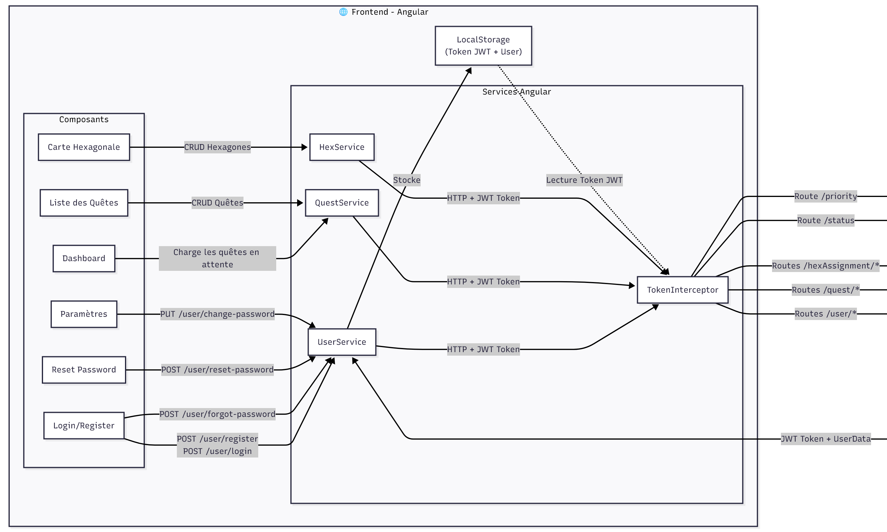
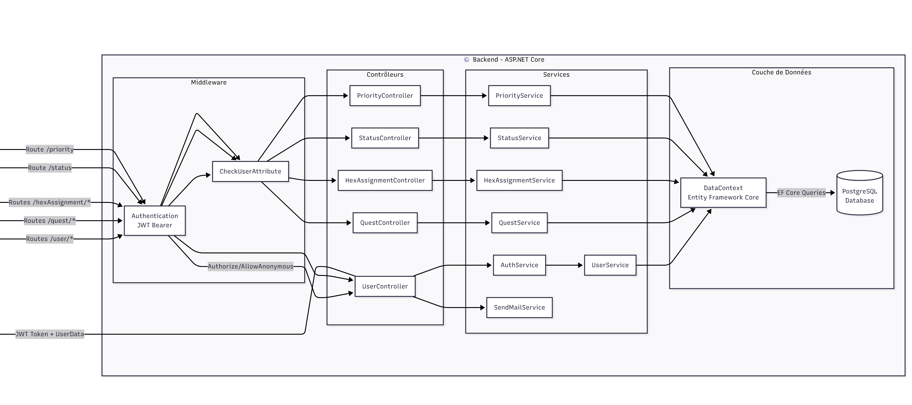

<h1 style="text-align: center; font-size: 3em; color: #8a2be2; font-weight: bold; display: block; margin: 100px auto 20px auto; width: 100%;">
HEXAPLANNING
</h1>

<h2 style="text-align: center; font-size: 1.8em; color: #7f8c8d; font-weight: normal; display: block; margin: 0 auto 50px auto; width: 100%;">
Carte interactive de gestion de tâches
</h2>

<div align="center" style="margin-top: 200px;">

</div>

<h3 style="text-align: center; font-size: 1.5em; font-weight: bold; display: block; width: 100%; margin-top: 200px;">
Réalisé par Antoine Simper
</h3>

<p style="text-align: center; margin-top: 30px;">
2024 - 2025
</p>

<div style="page-break-before: always;"></div>
<h5 style="color: transparent;">divider</h5>
<div style="page-break-before: always;"></div>

# Table des matières

**I. [Introduction](#i-introduction)**

1.  [Présentation du projet](#i-1-presentation-du-projet)
2.  [Objectifs et contexte](#i-2-objectifs-et-contexte)

**II. [Spécifications du projet](#ii-specifications-du-projet)**

1.  [Spécifications fonctionnelles](#ii-1-specifications-fonctionnelles)
2.  [Spécifications techniques](#ii-2-specifications-techniques)

**III. [Fonctionnalités principales](#iii-fonctionnalites-principales)**

1.  [Page d'accueil](#iii-1-page-d-accueil)
2.  [Gestion des quêtes (tâches)](#iii-2-gestion-des-quetes-taches)
3.  [Affichage visuel en hexagones (carte)](#iii-3-affichage-visuel-en-hexagones-carte)
4.  [Système d'authentification et gestion des utilisateurs](#iii-4-systeme-d-authentification-et-gestion-des-utilisateurs)
5.  [Navigation et ergonomie](#iii-5-navigation-et-ergonomie)

**IV. [Travail en équipe & méthodologie](#iv-travail-en-equipe-methodologie)**

1.  [Méthode Agile / Scrum](#iv-1-methode-agile-scrum)
2.  [Workflow & branches stratégie](#iv-2-workflow-branches-strategie)
3.  [Outils collaboratifs](#iv-3-outils-collaboratifs)

**V. [Modélisation des données](#v-modelisation-des-donnees)**

1.  [MCD (Modèle Conceptuel de Donnees)](#v-1-mcd-modele-conceptuel-de-donnees)
2.  [MLD (Modèle Logique de Données)](#v-2-mld-modele-logique-de-donnees)
3.  [Description des entités et relations](#v-3-description-des-entites-et-relations)

**VI. [Architecture technique et technologies](#vi-architecture-technique-et-technologies)**

1.  [Vue d'ensemble](#vi-1-vue-d-ensemble)
2.  [Frontend : Angular et PrimeNG](#vi-2-frontend-angular-et-primeng)
3.  [Backend : .NET Core](#vi-3-backend-net-core)
4.  [Base de données : PostgreSQL](#vi-4-base-de-donnees-postgresql)
5.  [Communication API REST](#vi-5-communication-api-rest)
6.  [Infrastructure et DevOps](#vi-6-infrastructure-et-devops)
7.  [Services externes](#vi-7-services-externes)

**VII. [Qualité logicielle et tests](#vii-qualite-logicielle-et-tests)**

1.  [Tests unitaires (backend)](#vii-1-tests-unitaires-backend)
2.  [Tests d’intégration](#vii-2-tests-d-integration)
3.  [Tests de charge et fixtures](#vii-3-tests-de-charge-et-fixtures)
4.  [Stratégie de validation](#vii-4-strategie-de-validation)

<div style="page-break-before: always;"></div>

**VIII. [CI / CD](#viii-ci-cd)**

1.  [Intégration continue (CI) de l’API](#viii-1-integration-continue)
2.  [Déploiement continu (CD) du backend](#viii-2-deploiement-continu)
3.  [Déploiement continu (CD) du frontend](#viii-3-deploiement-continu-cd-du-frontend)
4.  [Conteneurisation et orchestration](#viii-4-conteneurisation-et-orchestration)
5.  [Hébergement et reverse proxy](#viii-5-hebergement-et-reverse-proxy)

**IX. [Sécurité](#ix-securite)**

1.  [Authentification et gestion des accès](#ix-1-authentification-et-gestion-des-acces)
2.  [Validation et intégrité des données](#ix-2-validation-et-integrite-des-donnees)
3.  [Protection contre les attaques](#ix-3-protection-contre-les-attaques)
4.  [Sécurité de la conteneurisation et du déploiement](#ix-4-securite-de-la-conteneurisation-et-du-deploiement)

**X. [Conformité légale et réglementaire](#x-conformite-legale-et-reglementaire)**

1.  [CGU (Conditions Générales d'Utilisation)](#x-1-cgu-conditions-generales-d-utilisation)
2.  [RGPD (Protection des données)](#x-2-rgpd-protection-des-donnees)
3.  [RGE (Écoconception)](#x-3-rge-ecoconception)
4.  [Conformité et évolutions](#x-4-conformite-et-evolutions)

**XI. [Accessibilité et conformité RGAA](#xi-accessibilite-et-conformite-rgaa)**

1.  [Conformité RGAA et standards d'accessibilité](#xi-1-conformite-rgaa-et-standards-d-accessibilite)
2.  [Accessibilité des formulaires](#xi-2-accessibilite-des-formulaires)
3.  [Navigation au clavier et focus management](#xi-3-navigation-au-clavier-et-focus-management)
4.  [Technologies d'assistance et lecteurs d'écran](#xi-4-technologies-d-assistance-et-lecteurs-d-ecran)

**XII. [Veille technologique et résolution de problèmes](#xii-veille-tech-et-resolution)**

1.  [Veille technologique continue](#xii-1-veille-technologique)
2.  [Problèmes rencontrés et solutions](#xii-2-problemes-et-solutions)

**XIII. [Conclusion et perspectives](#xiii-conclusion-et-perspectives)**

1.  [Bilan du projet](#xiii-1-bilan-du-projet)
2.  [Perspectives d'évolution](#xiii-2-perspectives-d-evolution)
3.  [Ce que ce projet m'a apporté](#xiii-3-apport-projet)
4.  [Remerciements](#xiii-4-remerciements)

<div style="page-break-before: always;"></div>

# <a name='i-introduction'></a>I. Introduction

## 1. <a name='i-1-presentation-du-projet'></a>Présentation du projet

Hexaplanning est une application web de gestion de tâches, pensée pour transformer la to-do list classique en une expérience visuelle et ludique. Reprenant la nomenclature des jeux-vidéos, les tâches sont appelées "quêtes". Chacune d'entre elles peut être placée sur une carte d’hexagones, permettant à l’utilisateur de visualiser ses objectifs comme un parcours à accomplir.

Cette approche vise à rendre la planification plus motivante et interactive, en s’inspirant des mécaniques de jeu et de la gamification. Hexaplanning est destinée tout particulièrement aux personnes sujètes à un trouble de l'attention et ayant de la difficulté à se concentrer sur une tâche à la fois.

L'application a été développée en mobile-first, favorisant une utilisation quotidienne permettant à l'utilisateur d'avoir un aperçu de sa progression et de la mettre à jour régulièrement. Elle est bien entendu accessible également sur ordinateur, et l'utilisateur pourra se créer un compte pour accéder à sa progression depuis n'importe quel appareil.

## 2. <a name='i-2-objectifs-et-contexte'></a>Objectifs et contexte

Le projet est né du constat que la gestion des tâches peut rapidement devenir monotone et décourageante, surtout lorsqu’elle se limite à une simple liste. Hexaplanning propose une alternative visuelle et dynamique, où chaque utilisateur peut organiser ses quêtes selon ses priorités et ses envies, tout en bénéficiant d’un suivi clair de sa progression. L’application s’adresse à toute personne souhaitant mieux organiser son temps, que ce soit dans un cadre personnel, scolaire ou professionnel, et met l’accent sur l’ergonomie, la sécurité et la personnalisation de l’expérience.

D'un point de vue personnel, j'ai commencé à développer cette application seul en avril 2025.
Avant cela, une première version (sans la carte d'hexagones) avait été discutée en groupe pendant plusieurs mois, j'avais créé les wireframe et maquettes, et nous avions réalisés quelques composants de base en front-end. J'ai repris le projet à mon compte et l'ai modifié pour en faire ce qu'il est aujourd'hui, développant la quasi-totalité en 6 mois.

<div style="page-break-before: always;"></div>

# <a name='ii-specifications-du-projet'></a>II. Spécifications du projet

## 1. <a name='ii-1-specifications-fonctionnelles'></a> Spécifications fonctionnelles

### Fonctionnalités principales

- **Gestion des utilisateurs** : Inscription, connexion, changement et réinitialisation de mot de passe.
- **Gestion des quêtes** : Création, modification, suppression, changement rapide de statut.
- **Système de priorités** : Classification en trois niveaux (primaire, secondaire, tertiaire).
- **Visualisation hexagonale** : Assignation des quêtes sur une carte d'hexagones.
- **Suivi de progression** : Barre de progression et pourcentage d'avancement.

### User Stories

<div align="center">

</div>

<div align="center">
<em>User Stories en tant qu'utilisateur, réalisées avec Trello.</em>
</div>

### Diagramme de cas d'usage

<div align="center">

</div>

<div align="center">
<em>Diagramme de cas d'usage, réalisé avec Mermaid.</em>
</div>

**Analyse des cas d'usage :**

1. **Authentification** : Gestion complète de l'accès utilisateur avec sécurisation des mots de passe
2. **Gestion des Quêtes** : CRUD complet sur les tâches avec gestion des statuts et priorités
3. **Carte d'Expédition** : Visualisation sur une carte composée d'hexagones,avec assignation interactive
4. **Dashboard & Notifications** : Vue d'ensemble et notifications éphémères après chaque action

### Maquette (Figma)

<div align="center">

</div>

<div align="center">
<em>Version de départ de la maquette, réalisée avec Figma.</em>
</div>

### Objectifs pédagogiques du projet

- Développement d'une application web complète (frontend/backend)
- Mise en pratique des technologies modernes (Angular, .NET Core, PostgreSQL)
- Intégration de bonnes pratiques de développement (tests, CI/CD, sécurité)

## 2. <a name='ii-2-specifications-techniques'></a> Spécifications techniques

### Technologies et frameworks utilisés

**Frontend :**

- Angular 18 avec TypeScript
- PrimeNG pour les composants UI
- SCSS pour le styling responsive

**Backend :**

- ASP.NET Core 8 avec C#
- Entity Framework Core pour l'ORM
- PostgreSQL comme base de données
- ASP.NET Identity pour l'authentification

### Choix des langages et frameworks

- **Angular** : Framework mature avec une large communauté, TypeScript intégré
- **ASP.NET Core** : Performance élevée, sécurité intégrée, cross-platform
- **PostgreSQL** : SGBD relationnel open-source, robuste et performant

Angular et .NET permettent l'injection de dépendances (DI) et implémentent le principe d'inversion de contrôle (IoC), ce qui permet d'injecter aisément des services sans avoir à gérer manuellement leur instanciation.
Pour Angular, les services précédés du décorateur @Injectable() peuvent être injectés dans les composants avec 'inject' ou via le constructeur.
Pour .NET, une fois les services enregistrés dans le conteneur d'injection (par exemple via AddScoped()), ils peuvent être injectés dans toute classe. De plus, .NET permet l'application de tous les principes de la Programmation Orienté Objet (abstraction, héritage, polymorphisme et encapsulation) et de création d'une API REST.

### Outils de développement

- **Visual Studio Code** : IDE pour le front-end avec extensions spécialisées
- **Visual Studio** : IDE pour le back-end
- **GitKraken** : Interface graphique Git intuitive pour la gestion des branches et l'historique des commits
- **Swagger** : Documentation et accessibilité des endpoints de l'API

### Outils d'environnement (CI, Git, GitHub, Jest, Docker, Maven, Node.js, Navigateurs...)

- **Git/GitHub** : Contrôle de version et collaboration
- **GitHub Actions** : Intégration et déploiement continus
- **Docker** : Conteneurisation des services (frontend, backend, base de données)
- **Node.js** : Runtime pour les outils de build Angular
- **npm** : Gestionnaire de packages JavaScript
- **Navigateurs** : Chrome et Firefox pour les tests cross-browser

<div align="center">

</div>

<div align="center">

</div>

<div align="center">
<em>Organigramme Front / Back.</em>
</div>

<div style="page-break-before: always;"></div>

# <a name='iii-fonctionnalites-principales'></a>III. Fonctionnalités principales

## 1. <a name='iii-1-page-d-accueil'></a>Page d'accueil

<div align="center">

</div>

<div align="center">
<em>Page d'accueil d'Hexaplanning.</em>
</div>

La page d'accueil apparaît dès la connexion de l'utilisateur, et affiche le nombre de quêtes qu'il lui reste à accomplir

```html
<h1>Bienvenue {{ user()?.firstName | titlecase }} {{ user()?.lastName | titlecase }} !</h1>
<p>Vous avez <span class="quest-count">{{ pending_quests_number() }}</span> quête{{ pending_quests_number() > 1 ? 's' : '' }} à accomplir.</p>
```

```js
export class DashboardPageComponent {
  private readonly _userService = inject(UserService);
  private readonly _questService = inject(QuestService);
  user = this._userService.user;
  pending_quests_number = computed(() => this._questService.pendingQuests().length);

  constructor() {
    this._questService.getAllPendingQuests().subscribe();
  }
}
```

## 2. <a name='iii-2-gestion-des-quetes-taches'></a>Gestion des quêtes (tâches)

Les tâches, appelées "quêtes", sont au cœur de l’application. Chaque quête possède un titre, un statut (en attente, en cours et terminée) et une priorité (primaire, secondaire ou tertiaire, avec une icône et un code couleur associés), ainsi qu’une description et un temps estimé en option, ainsi qu'un pourcentage de progression (associé à une barre de progression) dans le cas des quêtes en cours. L’utilisateur peut créer, éditer ou supprimer une quête, la marquer rapidement comme terminée ou la remettre en attente, et l'associer à un hexagone sur la carte prévue à cet effet.

<div style="display: flex; justify-content: space-around; align-items: center; gap: 10px; margin: 20px 0;">
  <div style="text-align: center;">
    
    <br />
    <em>Modale de détails d'une quête.</em>
  </div>
  <div style="text-align: center;">
    
    <br />
    <em>Edition d'une quête existante.</em>
  </div>
  <div style="text-align: center;">
    
    <br />
    <em>Modale de suppression d'une quête.</em>
  </div>
</div>

Service de modale de quête :

```js
type QuestModalData = {
  quest: QuestUpdateDTO | QuestCreateDTO;
  isNew: boolean;
};

@Injectable({
  providedIn: 'root',
})
export class QuestModalService {
  private readonly _DEFAULT_QUEST: QuestCreateDTO = {
    title: '',
    estimatedTime: 0,
    description: '',
    statusId: '17c07323-d5b4-4568-b773-de3487ff30b1',
    priorityId: '17c07323-d5b4-4568-b773-de3487ff30b1',
  };

  private _questModalVisible = signal<boolean>(false);
  private _questModalData = signal<QuestModalData>({
    quest: this._DEFAULT_QUEST,
    isNew: false,
  });

  public questModalVisible = this._questModalVisible.asReadonly();
  public questModalData = this._questModalData.asReadonly();

  openQuestDetails(quest: QuestUpdateDTO, isNew = false): void {
    this._questModalData.set({ quest, isNew });
    this._questModalVisible.set(true);
  }

  openNewQuest(): void {
    this.openQuestDetails(this._DEFAULT_QUEST as QuestUpdateDTO, true);
  }

  closeQuestModal(): void {
    this._questModalVisible.set(false);
    this._questModalData.set({ quest: this._DEFAULT_QUEST, isNew: false });
  }
}
```

Nouvelle quête et édition de quête :

```js
export class QuestDetailsComponent implements OnInit, AfterViewInit {
  @Input({ required: true }) quest!: QuestUpdateDTO;
  @Input() isNew: boolean = false;

  private readonly _formBuilder = inject(FormBuilder);
  private readonly _questService = inject(QuestService);

  questForm!: FormGroup;
  isEdit: boolean = false;

  ngOnInit(): void {
    this._createFormGroup();
    this.resetForm();
    this._setFormValues();
  }

  private _createFormGroup(): void {
    this.questForm = this._formBuilder.group({
      title: new FormControl('', [Validators.required, Validators.maxLength(100)]),
      description: new FormControl(''),
      estimatedTime: new FormControl(''),
      priorityId: new FormControl('', Validators.required),
      statusId: new FormControl('', Validators.required),
      advancement: new FormControl(0),
    });
  }

  private _setFormValues(): void {
    this.questForm.setValue({
      title: this.quest?.title ?? '',
      // [...]
    });
  }

  onSubmit(): void {
    this.questForm.markAllAsTouched();

    if (this.questForm.invalid) return;

    const formValues = {
      ...this.questForm.value,
      estimatedTime: this.dateToMinutes(this.questForm.value.estimatedTime),
    };

    if (this.isNew) {
      const newQuest: QuestCreateDTO = formValues;

      this._questService.createQuest(newQuest).subscribe({
        next: () => {
          this._messageService.add({
            severity: 'success',
            summary: 'Quête créée',
            detail: newQuest.title,
            life: 2000,
          });
        },
        error: error => {
          this._messageService.add({
            severity: 'error',
            summary: 'Erreur',
            detail: 'Erreur lors de la création de la quête',
            life: 2000,
          });
        },
      });
    } else {
      const updatedQuest: QuestUpdateDTO = {
        ...this.quest,
        ...formValues,
      };

      this._questService.updateQuest(updatedQuest).subscribe(
        // [...]
      );
    }

    this.isEdit = false;
    this.isNew = false;
    this.closeDialog.emit();
  }
}
```

```html
<form [formGroup]="questForm" (ngSubmit)="onSubmit()" class="quest-form-group">
  <div>
    <!-- BOUTON RETOUR -->
    <button type="button" class="return pi pi-chevron-left" (click)="onReturn()" aria-label="bouton retour"></button>
    <!-- TITRE -->
    <div class="title">
      <label for="title" [class]="!isEdit && !isNew ? 'visually-hidden' : ''">Titre :</label>
      <textarea
        #titleTextarea
        id="title"
        formControlName="title"
        pTextarea
        [autoResize]="true"
        [readonly]="!isEdit"
        [ngClass]="{
          'quest-readonly': !isEdit,
          'p-invalid': questForm.get('title')?.invalid && questForm.get('title')?.touched
        }"
        maxlength="100"></textarea>
      @if (isEdit || isNew) {
      <small>{{ questForm.get('title')?.value?.length || 0 }}/100</small>
      } @if (questForm.get('title')?.invalid && questForm.get('title')?.touched) {
      <small class="p-error block mt-1"> Le titre est obligatoire </small>
      }
    </div>
  </div>

  <!-- STATUT -->
  <div>
    <label for="status" [class]="!isEdit && !isNew ? 'visually-hidden' : ''">Statut :</label>
    @if (isEdit) {
    <p-select
      id="status"
      formControlName="statusId"
      [options]="statusOptions ?? []"
      [disabled]="!isEdit"
      optionLabel="name"
      optionValue="id"
      [styleClass]="'custom-select'">
      <ng-template let-option pTemplate="item">
        <span> {{ option.name }} </span>
      </ng-template></p-select
    >
    } @else {
    <span class="font-bold">{{ getStatusName(quest.statusId) }}</span>
    }
  </div>
</form>
```

```css
.quest-form-group {
  display: flex;
  flex-direction: column;
  margin-bottom: 1rem;
  gap: 1rem;
  width: 18rem;
  margin: auto;
  padding: 1rem;
  justify-content: center;
  align-items: center;
}

.quest-readonly {
  border: none !important;
  background-color: transparent !important;
  box-shadow: none !important;
}
```

Un affichage standard des quêtes est proposé aux utilisateurs, sous forme de deux listes : l'une pour les quêtes à accomplir, l'autre pour les quêtes accomplies. La navigation se fait via un menu composé de deux onglets. Les quêtes à accomplir sont triées par ordre de priorité.

<div style="display: flex; justify-content: space-around; align-items: center; gap: 10px; margin: 20px 0;">
  <div style="text-align: center;">
    
    <br />
    <em>Liste des quêtes non accomplies.</em>
  </div>
  <div style="text-align: center;">
    
    <br />
    <em>Listes des quêtes accomplies.</em>
  </div>
  <div style="text-align: center;">
    
    <br />
    <em>Toast de succès : quête accomplie.</em>
  </div>
</div>

Listes de quêtes :

```html
<div class="quest-list">
  <h1>Vue d'ensemble</h1>
  <div class="quest-tabs">
    <p-tabMenu
      [model]="menuItems"
      [activeItem]="activeItem"
      (activeItemChange)="navigateOnMenu($event)"
      role="tablist"
      aria-label="Navigation entre les types de quêtes" />
  </div>
  @if (this.activeItem === this.menuItems[0]) {
  <div class="active-quests">
    @for (pendingQuest of pendingQuests; track pendingQuest.id) {
    <app-quest-card [quest]="pendingQuest"> </app-quest-card>
    }
  </div>
  } @else if (this.activeItem === this.menuItems[1]) {
  <div class="completed-quests">
    @for (completedQuest of completedQuests; track completedQuest.id) {
    <app-quest-card [quest]="completedQuest"> </app-quest-card>
    }
  </div>
  }
</div>
```

```js
export class QuestListPageComponent implements OnInit {
  _questService = inject(QuestService);

  menuItems!: MenuItem[];
  activeItem!: MenuItem;
  private _completedQuestsLoaded = false;

  get pendingQuests(): QuestUpdateDTO[] {
    return this._questService.pendingQuests();
  }
  get completedQuests(): QuestUpdateDTO[] {
    return this._questService.completedQuests();
  }

  ngOnInit(): void {
    this._questService.loadPendingQuests();

    this.menuItems = [{ label: 'Quêtes à accomplir' }, { label: 'Quêtes accomplies' }];
    this.activeItem = this.menuItems[0];
  }

  navigateOnMenu(event: MenuItem): void {
    this.activeItem = event;
    if (this.activeItem === this.menuItems[1] && !this._completedQuestsLoaded) {
      this._questService.loadCompletedQuests();
      this._completedQuestsLoaded = true;
    }
  }
}
```

Sur ces listes, l'utilisateur peut voir d'un coup d'oeil le titre de chaque quête ainsi qu'une icône représentant sa priorité, doublée d'un code couleur (orangé pour les principales, argenté pour les secondaires, gris foncé pour les tertiaires). Il dispose également d'un bouton à cocher pour aisément marquer une quête comme accomplie - ce qui déclenche un toast de succès - ou au contraire réhabiliter une quête terminée. Si la quête est indiquée comme "en cours", la barre de progression s'affiche directement sur l'aperçu de la quête, la remplissant progressivement d'une couleur plus sombre. Les quêtes terminées sont entièrement remplies.

## 3. <a name='iii-3-affichage-visuel-en-hexagones-carte'></a>Affichage visuel en hexagones (carte)

L’originalité d’Hexaplanning réside dans sa représentation visuelle : une carte d’hexagones sur laquelle l’utilisateur peut placer ses quêtes. Chaque hexagone peut accueillir une quête, et un code couleur sur le liseré permet d’identifier rapidement sa priorité (orangé pour les principales, argenté pour les secondaires, et aucun liseré pour les tertiaires). Les quêtes terminées apparaissent avec un fond plus sombre, et les quêtes en cours disposent d'une barre de progression radiale qui remplit progressivement l'hexagone avec cette couleur, à la manière d'une horloge.

<div align="center">

</div>

<div align="center">
<em>Page de la carte d'hexagones.</em>
</div>

L'utilisateur peut assigner une quête en cliquant ou appuyant sur un hexagone vide, faisant apparaître une modale contenant la liste de toutes les quêtes non accomplies, et en sélectionnant la quête de son choix. Il pourra ensuite la désassigner d'un simple clic sur l'icône de croix au-dessus du titre de la quête, ce qui déclenchera une modale de confirmation.

<div style="display: flex; justify-content: space-around; align-items: center; gap: 10px; margin: 20px 0;">
  <div style="text-align: center;">
    
    <br />
    <em>Modale d'assignation d'une quête à un hexagone.</em>
  </div>
  <div style="text-align: center;">
    
    <br />
    <em>Modale de désassignation d'une quête à un hexagone.</em>
  </div>
</div>

```html
<p-dialog class="select-dialog" [(visible)]="dialogVisible" [modal]="true" [dismissableMask]="true">
  <ng-template #header>
    @if (selectedHex) {
    <h3>Assigner une quête à accomplir</h3>
    }
  </ng-template>

  <div class="quest-selection">
    <div class="quest-list">
      @if (unassignedPendingQuests.length === 0) {
      <p>Aucune nouvelle quête à accomplir !</p>
      } @else { @for (quest of unassignedPendingQuests; track quest.id) {
      <div class="quest-item quest-card" (click)="selectQuest(quest)" [class.selected]="selectedQuest?.id === quest.id">
        <p-radioButton [value]="quest" [(ngModel)]="selectedQuest" [inputId]="'quest_' + quest.id"> </p-radioButton>
        <label [for]="'quest_' + quest.id" class="ml-2"> {{ quest.title }} </label>
        
      </div>
      } }
    </div>
  </div>
  <ng-template #footer>
    <p-button label="Annuler" icon="pi pi-times" (click)="dialogVisible = false" styleClass="p-button-text"> </p-button>
    <p-button label="Assigner" icon="pi pi-check" (click)="assignQuestToHex()" [disabled]="!selectedQuest"> </p-button>
  </ng-template>
</p-dialog>
```

```js
  assignQuestToHex(): void {
    if (this.selectedHex && this.selectedQuest) {
      const hexToUpdate = this.selectedHex;
      const questToAssign = this.selectedQuest;
      const hexAssignment = {
        q: hexToUpdate.q,
        r: hexToUpdate.r,
        s: hexToUpdate.s,
        questId: questToAssign.id,
      };

      this._hexService
        .saveAssignment(hexAssignment)
        .pipe(switchMap(() => this._questService.updateQuest({ ...questToAssign })))
        .subscribe({
          next: () => {
            hexToUpdate.quest = questToAssign;
            this.dialogVisible = false;
            this.selectedHex = null;
            this.selectedQuest = null;
            this._questService.loadUnassignedPendingQuests();
          },
          error: err => {
            console.error('Failed to assign quest:', err);
          },
        });
    }
  }
```

Tout comme sur les listes des quêtes, il suffit de cliquer ou d'appuyer sur un hexagone associé à une quête pour afficher les détails de la quête en question, et éventuellement modifier ou supprimer la quête (ce qui la fera disparaître de la carte et des listes).

## 4. <a name='iii-4-systeme-d-authentification-et-gestion-des-utilisateurs'></a>Système d'authentification et gestion des utilisateurs

L’accès à l’application nécessite la création d’un compte et une authentification sécurisée. L'utilisateur devra accepter les CGU et la politique de confidentialité, accessibles via des liens sur le formulaire de création de compte. Le mot de passe choisi devra respecter les normes standard : au minimum 8 caractères dont 1 lettre majuscule, 1 lettre minuscule, 1 chiffre et 1 caractère spécial. Après son enregistrement, l'utilisateur sera redirigé vers la page de connexion, et il peut aisément naviguer entre la connexion et la création de compte via un lien en bas de page.

<div align="center">

</div>

<div align="center">
<em>Page de création de compte.</em>
</div>
<br />

<div align="center">

</div>

<div align="center">
<em>Page de connexion.</em>
</div>

Validateurs lors de l'inscription :

```js
  constructor() {
    this.registerForm = this._formBuilder.group(
      {
        firstName: ['', [Validators.required, Validators.minLength(MIN_NAME_LENGTH)]],
        lastName: ['', [Validators.required, Validators.minLength(MIN_NAME_LENGTH)]],
        email: ['', [Validators.required, Validators.email]],
        password: ['', [Validators.required, apiPasswordValidator()]],
        confirmPassword: ['', [Validators.required]],
        acceptCgu: [false, [Validators.requiredTrue]],
        acceptRgpd: [false, [Validators.requiredTrue]],
      },
      { validators: passwordMatchValidator('password', 'confirmPassword') }
    );
  }
```

Extrait du validateur de mot de passe personnalisé :

```js
export const PASSWORD_REQUIREMENTS = {
  MIN_LENGTH: 8,
  MIN_UNIQUE_CHARS: 1,
  REQUIRE_DIGIT: true,
  REQUIRE_LOWERCASE: true,
  REQUIRE_UPPERCASE: true,
  REQUIRE_NON_ALPHANUMERIC: true,
} as const;

export function apiPasswordValidator(): ValidatorFn {
  return (control: AbstractControl): ValidationErrors | null => {
    const value = control.value;

    if (!value) return null;

    const errors: ValidationErrors = {};

    if (value.length < PASSWORD_REQUIREMENTS.MIN_LENGTH) {
      errors['minLength'] = {
        requiredLength: PASSWORD_REQUIREMENTS.MIN_LENGTH,
        actualLength: value.length,
      };
    }

    if (PASSWORD_REQUIREMENTS.REQUIRE_DIGIT && !/\d/.test(value)) {
      errors['requireDigit'] = true;
    }

    // [...]

    return Object.keys(errors).length > 0 ? errors : null;
  };

  export function passwordMatchValidator(passwordFieldName: string = 'password', confirmPasswordFieldName: string = 'confirmPassword'): ValidatorFn {
  return (form: AbstractControl): ValidationErrors | null => {
    const password = form.get(passwordFieldName);
    const confirmPassword = form.get(confirmPasswordFieldName);

    if (password && confirmPassword && password.value !== confirmPassword.value) {
      confirmPassword.setErrors({ ...confirmPassword.errors, passwordMismatch: true });
      return { passwordMismatch: true };
    }

    if (confirmPassword?.hasError('passwordMismatch')) {
      const errors = { ...confirmPassword.errors };
      delete errors['passwordMismatch'];
      const errorsCount = Object.keys(errors).length;
      confirmPassword.setErrors(errorsCount === 0 ? null : errors);
    }

    return null;
  };
}
```

Connexion de l'utilisateur :

```js
  onSubmit(): void {
    if (this.loginForm.valid) {
      this.isLoading = true;

      const loginData = {
        email: this.loginForm.value.email,
        password: this.loginForm.value.password,
      };

      this._userService.loginUser(loginData).subscribe({
        next: () => {
          this._messageService.add({
            severity: 'success',
            summary: 'Succès',
            detail: 'Connexion réussie!',
          });
          this.isLoading = false;
          this._router.navigate(['/']);
        },
        error: (error: any) => {
          this._messageService.add({
            severity: 'error',
            summary: 'Erreur',
            detail: 'Email ou mot de passe incorrect. Veuillez réessayer.',
          });
          this.isLoading = false;
          console.error('Login error:', error);
        },
      });
    } else {
      this._markFormGroupTouched();
    }
  }
```

Méthode correspondante dans le service utilisateurs :

```js
loginUser(user: UserLoginDTO): Observable<LoginResponseDTO> {
    return this._http.post<LoginResponseDTO>(this._apiUrl + '/login', user).pipe(
      tap(response => {
        this.user.set(response.user);
        this.token.set(response.token);
        localStorage.setItem('user', JSON.stringify(response.user));
        localStorage.setItem('token', response.token);
      })
    );
  }
```

Un système de gestion des mots de passe oubliés est en place, avec envoi d'email pour la réinitialisation. Lorsque l'utilisateur clique sur "mot de passe oublié", une modale s'ouvre. Si l'utilisateur avait déjà rentré son adresse e-mail dans le champ de connexion, il sera automatiquement reporté dans le champ de la modale. Au clic sur le bouton d'envoi, un toast informe l'utilisateur qu'un mail a été délivré à l'adresse indiquée, si elle existe. En effet, il s'agit de ne pas confirmer ou infirmer la présence de cette adresse e-mail dans la base de données. De plus, il ne peut y avoir qu'une seule requête vers la même adresse toutes les 5 minutes, afin d'éviter le spam d'une adresse e-mail et la saturation du service de mail.

<div align="center">

</div>

<div align="center">
<em>Modale de mot de passe oublié.</em>
</div>

Le destinataire recevera un mail contenant un lien de réinitialisation de mot de passe. Ce lien le redirigera vers la page prévue à cet effet, avec dans l'url un token valable une heure, et l'adresse e-mail du compte à modifier. Sans ces deux éléments valides, la requête ne pourra être acceptée. L'utilisateur n'a plus qu'à rentrer son nouveau mot de passe et à le confirmer, avant d'être redirigé vers la page de connexion.

<div align="center">

</div>

<div align="center">
<em>Mail de réinitialisation de mot de passe.</em>
</div>
<br />

<div align="center">

</div>

<div align="center">
<em>Page de réinitialisation de mot de passe.</em>
</div>

Composant de réinitialisation de mot de passe :

```js
export class ResetPasswordComponent implements OnInit {
  private readonly _formBuilder = inject(FormBuilder);
  private readonly _userService = inject(UserService);
  private readonly _router = inject(Router);
  private readonly _route = inject(ActivatedRoute);
  private readonly _messageService = inject(MessageService);

  resetPasswordForm: FormGroup;
  isLoading = false;
  token: string | null = null;
  email: string | null = null;

  constructor() {
    this.resetPasswordForm = this._formBuilder.group(
      {
        newPassword: ['', [Validators.required, apiPasswordValidator()]],
        confirmPassword: ['', [Validators.required]],
      },
      {
        validators: passwordMatchValidator('newPassword', 'confirmPassword'),
      }
    );
  }

  ngOnInit(): void {
    this.token = this._route.snapshot.queryParamMap.get('token');
    this.email = this._route.snapshot.queryParamMap.get('email');

    if (!this.token) {
      this._messageService.add({
        severity: 'error',
        summary: 'Erreur',
        detail: 'Token de réinitialisation manquant ou invalide.',
      });
      this._router.navigate(['/login']);
    }
  }

  onSubmit(): void {
    if (this.resetPasswordForm.valid && this.token && this.email) {
      this.isLoading = true;

      const resetPasswordData: ResetPasswordDTO = {
        token: this.token,
        email: this.email,
        newPassword: this.resetPasswordForm.value.newPassword,
        confirmPassword: this.resetPasswordForm.value.confirmPassword,
      };

      this._userService.resetPassword(resetPasswordData).subscribe({
        // [...]
      });
    } else {
      this._markFormGroupTouched();
    }
  }
}
```

L'utilisateur peut également changer son mot de passe depuis l'interface : en accédant au menu des paramètres, il aura la possibilité d'ouvrir une modale lui demandant son mot de passe actuel ainsi que le nouveau. Depuis ce même menu, il pourra se déconnecter de l'application.

<div style="display: flex; justify-content: space-around; align-items: center; gap: 10px; margin: 20px 0;">
  <div style="text-align: center;">
    
    <br />
    <em>Page de paramètres.</em>
  </div>
  <div style="text-align: center;">
    
    <br />
    <em>Modale de changement de mot de passe.</em>
  </div>
  <div style="text-align: center;">
    
    <br />
    <em>Modale de déconnexion.</em>
  </div>
</div>

La sécurité des données et la protection contre les accès non autorisés sont assurées par des mécanismes robustes côté backend.

<div style="page-break-before: always;"></div>

## 5. <a name='iii-5-navigation-et-ergonomie'></a>Navigation et ergonomie

L’application propose un menu apparaissant en permanence en bas de page, et permettant de naviguer entre l’accueil, les listes de quêtes, la carte des hexagones et les paramètres. Un bouton dédié au centre du menu permet de créer rapidement une nouvelle quête, qui viendra s'insérer dans la liste qui lui correspond, et sera accessible dans la modale d'assignation à un hexagone.

<div align="center">

</div>

<div align="center">
<em>Modale de création de quête.</em>
</div>

```html
<div [routerLink]="['/']">
  <i class="material-icons icon" [ngClass]="{ active: activeIcon === 'home' }">home</i>
</div>
```

```js
export class MenuComponent implements OnInit, OnDestroy {
  _questModalService = inject(QuestModalService);
  _router = inject(Router);
  _routerSubscription!: Subscription;

  ngOnInit(): void {
    this.setActiveBasedOnUrl(this._router.url);
    this._routerSubscription = this._router.events.pipe(filter(event => event instanceof NavigationEnd)).subscribe((event: NavigationEnd) => {
      this.setActiveBasedOnUrl(event.url);
    });
  }

  ngOnDestroy(): void {
    if (this._routerSubscription) {
      this._routerSubscription.unsubscribe();
    }
  }

  setActiveBasedOnUrl(url: string): void {
    if (url === '/') {
      this.activeIcon = 'home';
    } else if (url.includes('/quest-list')) {
      this.activeIcon = 'quest-list';
    } [else if (url.includes('/map')) {
      this.activeIcon = 'map';
    } else if (url.includes('/settings')) {
      this.activeIcon = 'settings';
    } else {
      this.activeIcon = '';
    }]
  }

  navigateToRoute(route: string): void {
    this._router.navigate([route]);
  }

  showNewQuestDialog(): void {
    this._questModalService.openNewQuest();
  }
}
```

L'interface est pensée pour être intuitive, responsive et agréable à utiliser, afin de maximiser l'engagement et la productivité de l'utilisateur.

<div style="page-break-before: always;"></div>

# <a name='iv-travail-en-equipe-methodologie'></a>IV. Travail en équipe & méthodologie

## 1. <a name='iv-1-methode-agile-scrum'></a> Méthode Agile / Scrum

### Méthodologie adoptée

Le projet Hexaplanning a été développé tout d'abord en collaboration, puis en solo. La méthode Agile a été adoptée au fil du projet :

- **Sprints de 2 semaines** : Cycles de développement courts et itératifs
- **User Stories** : Fonctionnalités définies du point de vue utilisateur
- **Backlog Product** : Priorisation des fonctionnalités selon la valeur métier
- **Daily Standup** : Points quotidiens sur l'avancement (adaptés selon disponibilité)

### Découpage du projet

**Sprint 1 : Fondations**

- Réalisation du wireframe et de la maquette
- Mise en place des User Stories
- Configuration de l'environnement de développement
- Architecture de base (frontend Angular + backend .NET)
- Authentification et gestion des utilisateurs

**Sprint 2 : Fonctionnalités core**

- CRUD des quêtes
- Système de priorités et statuts
- Interface de liste des quêtes

**Sprint 3 : Visualisation**

- Développement de la carte hexagonale
- Assignation des quêtes aux hexagones
- Interactions et animations

**Sprint 4 : Finalisation**

- Tests et corrections de bugs
- Documentation
- Déploiement et mise en production

## 2. <a name='iv-2-workflow-branches-strategie'></a> Workflow & branches stratégie

### Git Workflow adopté

**Stratégie de branching :**

- **main** : Branche de production, code stable
- **develop** : Branche de développement, intégration des features
- **feature/** : Branches pour chaque nouvelle fonctionnalité
- **hotfix/** : Corrections urgentes sur la production

### Processus de développement

```bash
# Création d'une nouvelle feature
git checkout develop
git pull origin develop
git checkout -b feature/quest-management

# Développement et commits
git add .
git commit -m "feat: add quest creation functionality"

# Push et Pull Request
git push origin feature/quest-management
# Création PR sur GitHub : feature/quest-management -> develop
```

### Code Review

- **Pull Requests obligatoires** : Aucun code ne merge sans review
- **Critères de validation** : Tests passants, documentation, respect des conventions
- **Reviewers** : Au moins un autre développeur valide les modifications

## 3. <a name='iv-3-outils-collaboratifs'></a> Outils collaboratifs

### Gestion de projet

- **Jira** : Tableau Kanban pour le suivi des tâches

### Communication

- **Discord** : Communication instantanée de l'équipe

### Documentation partagée

- **Figma** : Maquettes et schémas d'architecture collaboratifs
- **Confluence/Notion** : Spécifications fonctionnelles et notes de réunion

<div style="page-break-before: always;"></div>

# <a name='v-modelisation-des-donnees'></a>V. Modélisation des données

## 1. <a name='v-1-mcd-modele-conceptuel-de-donnees'></a>MCD (Modèle Conceptuel de Données)

<div align="center">

</div>

<div align="center">
<em>Schéma de la base de données relationnelle d'Hexaplanning, réalisé avec dbdiagram.io.</em>
</div>

<div style="page-break-before: always;"></div>

## 2. <a name='v-2-mld-modele-logique-de-donnees'></a>MLD (Modèle Logique de Données)

- Table **UserApp** (Id PK, FirstName, LastName, Email, PasswordHash, CreatedAt, UpdatedAt, IsArchived, ...)
- Table **Quest** (Id PK, Title, Description, EstimatedTime, Advancement, UserId FK, PriorityId FK, StatusId FK, HexAssignmentId FK, CreatedAt, UpdatedAt, IsArchived)
- Table **Priority** (Id PK, Name, Color, BorderColor, Icon, CreatedAt, UpdatedAt, IsArchived)
- Table **Status** (Id PK, Name, Color, Icon, CreatedAt, UpdatedAt, IsArchived)
- Table **HexAssignment** (Id PK, Q, R, S, QuestId FK, CreatedAt, UpdatedAt, IsArchived)
- Table **Mail** (MailTo, MailSubject, MailBody, MailFrom, Receiver)

## 3. <a name='v-3-description-des-entites-et-relations'></a>Description des entités et relations

### UserApp (Utilisateur)

- Un utilisateur peut créer plusieurs quêtes.
  Il possède :
  - Un nom et un prénom.
  - Une adresse e-mail unique.
  - Un mot de passe (hashé dans la base de données).
  - Une liste de quêtes.
  - Des métadonnées : date de création, date de mise à jour, statut d'archivage.

### Quest (Quête)

- Une quête appartient à un seul utilisateur.
  Elle possède :
  - Un titre (limité à 100 caractères).
  - Optionnellement, une description.
  - Optionnellement, un temps estimé.
  - Un pourcentage d'avancement (Advancement) pour les quêtes en cours.
  - Un UserId pour la rattacher à son utilisateur.
  - Un PriorityId pour définir sa priorité.
  - Un StatusId pour définir son statut.
  - Optionnellement, un HexAssignmentId pour l'assigner à un hexagone.
  - Des métadonnées : date de création, date de mise à jour, statut d'archivage.

### Priority (Priorité)

- Une priorité peut être associée à plusieurs quêtes.
  Elle possède :
  - Un nom (PRIMARY, SECONDARY, TERTIARY).
  - Une couleur principale.
  - Une couleur de bordure (BorderColor) pour l'affichage sur la carte.
  - Optionnellement, une icône.
  - Des métadonnées : date de création, date de mise à jour, statut d'archivage.

<div style="page-break-before: always;"></div>

### Status (Statut)

- Un statut peut être associé à plusieurs quêtes.
  Il possède :
  - Un nom (en attente, en cours, terminée).
  - Une couleur pour l'affichage.
  - Optionnellement, une icône.
  - Des métadonnées : date de création, date de mise à jour, statut d'archivage.

### HexAssignment (Assignation d'hexagone)

- Un hexagone (HexAssignment) est lié à une seule quête.
  Il possède :
  - Un jeu de coordonnées q, r, s qui lui est unique (système de coordonnées hexagonales).
  - Un QuestId pour la quête assignée.
  - Des métadonnées : date de création, date de mise à jour, statut d'archivage.

### Mail

- Un mail est indépendant et permet d'envoyer des communications (réinitialisation de mot de passe, bienvenue, etc.).
  Il possède :
  - Un destinataire (MailTo).
  - Un sujet (MailSubject).
  - Un corps de message (MailBody).
  - Un expéditeur (MailFrom).
  - Un destinataire lié à un utilisateur (Receiver).

### Relations principales :

- **UserApp 1:N Quest** : Un utilisateur possède plusieurs quêtes.
- **Quest N:1 Priority** : Une quête a une priorité.
- **Quest N:1 Status** : Une quête a un statut.
- **Quest 1:1 HexAssignment** : Une quête peut être assignée à un hexagone (optionnel).

<div style="page-break-before: always;"></div>

# <a name='vi-architecture-technique-et-technologies'></a>VI. Architecture technique et technologies

## 1. <a name='vi-1-vue-d-ensemble'></a> Vue d'ensemble

Hexaplanning adopte une architecture moderne en trois couches avec une séparation claire des responsabilités. Le choix des technologies s'est fait en privilégiant la robustesse, la maintenabilité et l'écosystème de chaque solution. L'architecture repose sur :

- **Frontend** : Angular 18 avec PrimeNG pour une interface utilisateur moderne et responsive
- **Backend** : ASP.NET Core 8 pour une API REST performante et sécurisée
- **Base de données** : PostgreSQL pour la persistance des données
- **Infrastructure** : Docker et GitHub Actions pour le déploiement et l'intégration continue
- **Services externes** : Brevo pour l'envoi d'e-mails transactionnels

Cette approche modulaire facilite la maintenance, l'évolutivité et la sécurité de l'application. La communication entre les couches s'effectue via une API REST sécurisée par JWT.

### <a name='Schmaglobal'></a>Schéma global

<div align="center">

</div>

<div align="center">
<em>Schéma global de l'architecture d'Hexaplanning.</em>
</div>

## 2. <a name='vi-2-frontend-angular-et-primeng'></a> Frontend : Angular et PrimeNG

### Choix technologiques et justifications

- **Angular 18** : Framework SPA reconnu pour sa structure modulaire, sa maintenabilité et sa communauté active. Il facilite la création d'interfaces dynamiques, responsives et testables. Le choix de la version 18 apporte les dernières optimisations de performance et les nouveautés du framework. L'utilisation de Typescript facilite la maintenance et réduit les erreurs de développement.

- **PrimeNG** : Bibliothèque de composants UI riche et moderne pour Angular, fournissant les éléments d'interface (modales, formulaires, boutons, toasts) avec un design cohérent et professionnel. Alternative considérée : Angular Material, mais PrimeNG est plus intuitif et facilement personnalisable.

### Architecture et organisation

- **Structure modulaire** : Organisation en pages faisant appel à des composants réutilisables, des services, des pipes et des modèles de DTO. Routes avec guards et interceptors.
- **Approche mobile-first** : Interface responsive optimisée pour les appareils mobiles.

<div style="page-break-before: always;"></div>

### Responsabilités principales

- Gestion de l'interface utilisateur et de l'expérience utilisateur
- Navigation entre les différentes pages et modales
- Appels API vers le backend et gestion des réponses
- Gestion du token JWT pour l'authentification
- Affichage dynamique de la carte d'hexagones avec coordonnées hexagonales
- CRUD des quêtes avec validation côté client

### Sécurité

- **Intercepteur HTTP** : Ajout automatique du JWT dans toutes les requêtes API
- **Guards de navigation** : Protection des routes sensibles (authentification requise)
- **Validation des formulaires** : Contrôles côté client avant envoi au backend

### Tests et qualité

- **ESLint** : Analyse statique du code pour maintenir la qualité

### Conventions Angular respectées

- **kebab-case** pour les sélecteurs : `app-quest-card`
- **camelCase** pour les propriétés : `questTitle`, `isCompleted`
- **PascalCase** pour les classes : `QuestComponent`, `QuestService`

## 3. <a name='vi-3-backend-net-core'></a> Backend : .NET Core

### Choix technologiques et justifications

- **ASP.NET Core 8** : Framework backend performant, sécurisé et multiplateforme, idéal pour exposer une API REST robuste et scalable. La version 8 LTS garantit la stabilité et le support à long terme.

- **Entity Framework Core** : ORM facilitant la gestion et la migration de la base de données, tout en assurant la cohérence des modèles.

- **ASP.NET Identity** : Système d'authentification et d'autorisation intégré, robuste et éprouvé pour la gestion des utilisateurs et des mots de passe.

### Architecture en couches

L'API suit une architecture en couches claire pour séparer les responsabilités :

- **Controllers** : Points d'entrée API, gestion des requêtes HTTP et des réponses
- **Services** : Logique métier, règles de gestion et orchestration des opérations
- **Models** : Entités de domaine et DTOs pour le transfert de données
- **DataContext** : Couche d'accès aux données avec Entity Framework
- **Utilities** : Classes utilitaires et helpers transversaux

<div style="page-break-before: always;"></div>

### Modèle générique BaseModel

L'architecture utilise un **modèle générique d'héritage** pour standardiser les entités et éviter la duplication de code :

**BaseModel - Classe commune :**

```csharp
    public class BaseModel : IArchivable, ICreatable, IUpdatable
    {
        [Key]
        public Guid Id { get; set; } = Guid.NewGuid();
        public DateTime CreatedAt { get; set; } = DateTime.UtcNow;
        public DateTime? UpdatedAt { get; set; } = DateTime.UtcNow;
        public bool IsArchived { get; set; }
    }
```

Les trois interfaces implémentées ici (Archivable, Creatable, Updatable) imposent des propriétés communes.
Toutes les classes créées dans l'API hériteront de BaseModel. Les classes héritant de Identity implémenteront les mêmes interfaces que BaseModel afin d'assurer la cohérence globale.

**BaseModelOption - Pour les options de priorité et de statut des quêtes :**

```csharp
    public class BaseModelOption : BaseModel
    {
        public string Name { get; set; }
        public string Color { get; set; }
        public string? Icon { get; set; }
    }
```

**Utilisation dans les entités métier (exemples avec une partie de la classe Quest qui hérite de BaseModel, et avec la classe Priority qui hérite de BaseModelOption) :**

```csharp
public class Quest : BaseModel
{
    public string Title { get; set; }
    public string Description { get; set; }
    public int UserId { get; set; }
    public int PriorityId { get; set; }
    public int StatusId { get; set; }
    // Propriétés héritées automatiquement : Id, CreatedAt, UpdatedAt, IsArchived
}

public class Priority : BaseModelOption
{
    public string BorderColor { get; set; }
    // Propriétés héritées : Id, Name, Color, Icon, CreatedAt, UpdatedAt, IsArchived
}
```

<div style="page-break-before: always;"></div>

**Avantages de cette approche :**

- **Cohérence** : Toutes les entités partagent les mêmes métadonnées
- **Maintenance** : Modifications centralisées dans BaseModel
- **Audit** : Traçabilité automatique (CreatedAt, UpdatedAt)
- **Préparation aux améliorations futures** : avec une option d'archivage.

### Sécurité intégrée

- **Middleware JWT** : Authentification automatique sur tous les endpoints protégés

Exemple dans le contrôleur de quêtes, avec l'attribut Authorize :

```csharp
/// <summary>
/// Gestion des quêtes
/// </summary>
[Route("[controller]")]
[Authorize]
[ApiController]
[CheckUser]
public class QuestController : ControllerBase
{}
```

- **Validation des entrées** : Contrôles sur toutes les données reçues

Exemple dans une partie du DTO de création de quête avec un titre qui doit être une chaîne de caractères limitée à 100 caractères :

```csharp
    public class QuestCreateDTO
    {
        [Required]
        [StringLength(100)]
        public string Title { get; set; }

        public string? Description { get; set; }
    }
```

<div style="page-break-before: always;"></div>

- **Protection anti-attaques** : Protection contre l'injection SQL en utilisant l'ORM Entity Framework

Exemple avec la méthode de récupération de toutes les quêtes d'un utilisateur donnée, dans le QuestService :

```csharp
/// <summary>
/// Récupère toutes les quêtes d'un utilisateur spécifique.
/// </summary>
/// <param name="userId">L'identifiant unique (GUID) de l'utilisateur.</param>
/// <returns>
/// Une liste de <see cref="QuestDTO"/> contenant toutes les quêtes associées à l'utilisateur.
/// Retourne une liste vide si l'utilisateur n'a aucune quête.
/// </returns
public async Task<List<QuestDTO>> GetAllQuestsAsync(Guid userId)
{
    var quests = await context.Quests.Where(x => x.UserId == userId).ToListAsync();
    return quests.Select(QuestDTO.ToQuestDTO).ToList();
}
```

- **Rate limiting** : Protection contre les tentatives de force brute

On utilise pour cela les options de Lockout fournies par ASP .NET Identity, qu'on configure dans Program.cs :

```csharp
services.Configure<IdentityOptions>(options =>
  {
      options.Lockout.DefaultLockoutTimeSpan = TimeSpan.FromMinutes(2);
      options.Lockout.MaxFailedAccessAttempts = 5;
      options.Lockout.AllowedForNewUsers = true;
  });
```

<div style="page-break-before: always;"></div>

- **Gestion des droits** : Chaque utilisateur n'accède qu'à ses propres données

### Mécanisme CheckUser - Isolation des données utilisateur

L'API implémente un **système de vérification automatique** (`CheckUser`) de façon à ce que chaque utilisateur ne puisse accéder qu'à ses propres ressources :

```csharp
public class CheckUserAttribute : ActionFilterAttribute
{
    public override void OnActionExecuting(ActionExecutingContext context)
    {
        var user = context.HttpContext.User;
        var userId = CheckUser.GetUserIdFromClaim(user);

        if (!userId.HasValue)
        {
            context.Result = new UnauthorizedResult();
            return;
        }

        context.HttpContext.Items["UserId"] = userId.Value;

        base.OnActionExecuting(context);
    }
}
```

On récupère l'identifiant de l'utilisateur qui est un des claims du token JWT transmis avec la requête HTTP. On le stocke alors dans le contexte HTTP, pour pouvoir y accéder dans les méthodes qui utilisent l'attribut CheckUser, et vérifier que l'identifiant correspond aux données auxquelles on souhaite accéder.

Exemple d'application dans le contrôleur de quêtes :

```csharp
[HttpGet]
public async Task<IActionResult> GetAllQuests()
{
    if (HttpContext.Items["UserId"] is Guid userId)
    {
        var quests = await questService.GetAllQuestsAsync(userId);
        return Ok(quests);
    }
    return Unauthorized();
}
```

Chaque contrôleur qui comporte des méthodes nécessitant de vérifier l'utilisateur dont émane la requête est décoré par l'attribut [CheckUser].

<div style="page-break-before: always;"></div>

**Avantages du système CheckUser :**

- **Sécurité renforcée** : Impossible d'accéder aux données d'autres utilisateurs
- **Validation automatique** : Contrôle systématique sur toutes les opérations
- **Code centralisé** : Logique de vérification réutilisable dans tous les contrôleurs
- **Performance** : Vérification rapide basée sur les claims JWT

### Tests et qualité

- **xUnit** : Framework de tests unitaires moderne et flexible, intégré à l'écosystème .NET
- **Tests d'intégration** : Validation complète des endpoints avec base de données de test, qui utilisent des Testcontainers pour générer une base de donénes PostgreSQL et effectuer une validation réelle.

### Standards de développement et qualité du code

**Programmation orientée objet respectée :**

L'architecture backend .NET Core respecte les principes OOP :

- **Encapsulation** : Propriétés privées avec validation dans les setters
- **Héritage** : Classes `BaseModel` et `BaseModelOption` pour standardiser les entités

**Conventions de nommage C# :**

- **PascalCase** pour classes et méthodes : `QuestService`, `GetQuestById`
- **camelCase** pour variables locales : `questDto`, `userId`
- **Constantes en UPPER_CASE** : `MAX_QUEST_TITLE_LENGTH`

<div style="page-break-before: always;"></div>

**Documentation XML pour .NET :**

Chaque méthode de contrôleur est documentée, ce qui ajoute une description aux endpoints sur Swagger.

Exemple avec la méthode de création de quête :

```csharp
/// <summary>
/// Crée une nouvelle quête pour l'utilisateur authentifié.
/// </summary>
/// <param name="questDto">Les données de la quête à créer.</param>
/// <returns>
/// Une réponse HTTP 201 Created contenant la quête créée avec son identifiant unique,
/// ainsi qu'un en-tête Location pointant vers l'endpoint de récupération de la quête.
/// </returns>
/// <response code="201">La quête a été créée avec succès. Retourne la quête avec son ID généré.</response>
/// <response code="400">Les données fournies sont invalides (validation échouée).</response>
/// <response code="401">L'utilisateur n'est pas authentifié ou le token JWT est invalide.</response>
/// <response code="409">Une quête est déjà associée à cet hexagone (contrainte d'unicité violée).</response>
[HttpPost]
public async Task<IActionResult> CreateQuest([FromBody] QuestCreateDTO questDto)
{}
```

## 4. <a name='vi-4-base-de-donnees-postgresql'></a> Base de données : PostgreSQL

### Choix technologique et justifications

- **PostgreSQL** : SGBD open source reconnu pour sa fiabilité et ses performances, plus robuste que MySQL par exemple, si l'application continue d'évoluer.

### Modélisation et structure

- **Respect du MCD/MLD** : Implementation fidèle du modèle conceptuel présenté au chapitre III
- **Contraintes d'intégrité** : Clés étrangères, contraintes CHECK et UNIQUE pour la cohérence des données

### Gestion et évolution

- **Migrations Entity Framework Core** : Versioning automatique du schéma de base de données
- **Code-First approach** : Génération du schéma à partir des modèles C#
- **Seeding** : Données initiales (priorités, statuts) injectées automatiquement

<div style="page-break-before: always;"></div>

### Sécurité

- **Accès restreint** : Connexion uniquement via l'API backend.
- **Isolation des données** : Chaque utilisateur accède uniquement à ses propres données
- **Mots de passe sécurisés** : Hashés avec ASP.NET Identity

## 5. <a name='vi-5-communication-api-rest'></a> Communication API REST

### Architecture RESTful

- **Format de données** : JSON via HTTP(S) pour tous les échanges
- **Verbes HTTP** : Utilisation sémantique (GET, POST, PUT, DELETE)
- **Codes de réponse** : Status codes HTTP appropriés (200, 201, 400, 401, 404, 500)
- **Structure des URLs** : Routes RESTful cohérentes (`/quests`, `/users/{id}`)

### Endpoints principaux

- **Authentification** : `/auth/login`, `/auth/register`, `/auth/reset-password`
- **Gestion des quêtes** : CRUD complet sur `/quests` avec filtrage par utilisateur
- **Gestion des hexagones** : `/hexassignments` pour l'assignation des quêtes
- **Gestion des utilisateurs** : `/users` pour les profils et paramètres
- **Données de référence** : `/priorities`, `/statuses` pour les listes déroulantes

### Sécurité et authentification

- **JWT Bearer Token** : Toutes les routes sensibles protégées par authentification
- **CORS configuré** : Origines autorisées limitées aux domaines de l'application
- **Validation des données** : Contrôles stricts sur tous les inputs API

### Gestion des erreurs

- **Réponses structurées** : Format JSON consistent pour les erreurs
- **Messages explicites** : Informations claires pour le débogage côté frontend

## 6. <a name='vi-6-infrastructure-et-devops'></a> Infrastructure et DevOps

### Conteneurisation

- **Docker** : Conteneurisation de chaque composant pour garantir la portabilité, l'isolation et la reproductibilité des environnements. Chaque service (frontend, backend, base de données) dispose de son propre Dockerfile optimisé.

- **docker-compose** : Orchestration simplifiée du déploiement multi-conteneurs. Gestion des dépendances entre services, des variables d'environnement et des volumes persistants.

<div style="page-break-before: always;"></div>

### Intégration et déploiement continu

- **GitHub Actions** : Automatisation des pipelines CI/CD. Pipelines séparés pour le frontend et le backend avec tests automatisés.
- **Workflow CI** : Tests unitaires et d'intégration automatiques avant chaque déploiement
- **Workflow CD** : Build, push vers Docker Hub et déploiement automatique sur le VPS

### Hébergement et infrastructure

- **OVH VPS** : Hébergement flexible et sécurisé, adapté à la montée en charge. Serveur Linux Ubuntu avec Docker et docker-compose installés.
- **Nginx Proxy Manager** : Gestion centralisée des domaines, des certificats SSL et du reverse proxy. Interface web pour la configuration des routes et des certificats Let's Encrypt automatiques.

## 7. <a name='vi-7-services-externes'></a> Services externes

### Brevo (ex-Sendinblue)

- **Service d'emailing transactionnel** : Solution cloud fiable et simple à intégrer pour l'envoi d'e-mails automatisés
- **Utilisation** : Envoi de mails de réinitialisation de mot de passe
- **Avantages** : API simple et tarification adaptée aux petits volumes, plus simple et plus économique qu'un serveur mail à héberger

Le service d'envoi de mail est pour le moment utilisé uniquement pour la réinitialisation de mot de passe.

Une vérification est effectuée avant l'envoi, pour s'assurer que la requête n'est pas envoyé à la même adresse plus d'une fois toutes les 5 minutes. Pour cela on crée une variable :

```csharp
private static readonly Dictionary<string, DateTime> _lastResetRequest = new();
```

Au début de la méthode, on vérifie que la dernière requête n'a pas été effectuée il y a peu, puis on configure le client SMTP, on cherche l'utilisateur associé à l'adresse e-mail renseignée (s'il n'est pas trouvé, on renvoie tout de même un message de succès pour ne pas révéler si l'adresse existe en base de données), puis on génère un token de réinitialisation de mot de passe qu'on insère dans un lien avec l'adresse e-mail, de façon à le transmettre dans le template de mail.

<div style="page-break-before: always;"></div>

```csharp
public async Task<bool> SendPasswordResetEmail(string emailAddress)
{
    try
    {
        if (_lastResetRequest.TryGetValue(emailAddress, out var lastRequest))
        {
            if (DateTime.UtcNow - lastRequest < TimeSpan.FromMinutes(5)) return true;
        }
        _lastResetRequest[emailAddress] = DateTime.UtcNow;

        var smtpClient = new SmtpClient(Env.SMTP_HOST)
        {
            Port = Int32.Parse(Env.SMTP_PORT),
            Credentials = new NetworkCredential(
                Env.SMTP_EMAILFROM,
                Env.SMTP_PASSWORD
            ),
            EnableSsl = true
        };

        var user = await _userManager.FindByEmailAsync(emailAddress);
        if (user == null)
        {
            // Pour des raisons de sécurité, on ne révèle pas si l'email existe
            return true;
        }

        var resetToken = await _userManager.GeneratePasswordResetTokenAsync(user);
        var encodedToken = Uri.EscapeDataString(resetToken);
        var resetLink = $"{Env.API_FRONT_URL}/reset-password?token={encodedToken}&email={Uri.EscapeDataString(emailAddress)}";

        var mailMessage = new MailMessage
        {
            // Template du mail
        };

        mailMessage.To.Add(user.Email);

        await smtpClient.SendMailAsync(mailMessage);

        return true;
    }
    catch
    {
        throw;
    }
}
```

<div style="page-break-before: always;"></div>

# <a name='vii-qualite-logicielle-et-tests'></a>VII. Qualité logicielle et tests

La qualité logicielle d’Hexaplanning repose sur une stratégie de tests complète, principalement concentrée sur l’API .NET, afin de garantir la robustesse, la fiabilité et la maintenabilité du backend.

## 1. <a name='vii-1-tests-unitaires-backend'></a> Tests unitaires (backend)

Les tests unitaires sont réalisés avec xUnit et couvrent les principaux services métiers, notamment le service de gestion des quêtes (`QuestService`). Ces tests vérifient le bon fonctionnement des méthodes de création, lecture, mise à jour et suppression de quêtes, ainsi que la gestion des cas limites (identifiants invalides, absence de données, etc.).

Exemples de méthodes testées :

- Création d’une quête (`CreateQuestAsync`)
- Récupération d’une quête par ID (`GetQuestByIdAsync`)
- Mise à jour et suppression de quêtes (`UpdateQuestAsync`, `DeleteQuestAsync`)
- Récupération des quêtes selon leur statut (en attente, terminées, non assignées)

Extrait du service de tests unitaire, qui injecte une base de données InMemory dans un DataContext qui sera utilisé par un QuestService dédié. Ici, on vérifie qu'on peut récupérer une quête par son identifiant, et qu'on a aucun retour si l'identifiant est incorrect :

```csharp
public class QuestServiceTests
{
  private readonly DataContext _context;
  private readonly QuestService _questService;

  public QuestServiceTests()
  {
      var options = new DbContextOptionsBuilder<DataContext>()
          .UseInMemoryDatabase(databaseName: Guid.NewGuid().ToString())
          .Options;

      _context = new DataContext(options);
      _questService = new QuestService(_context);
  }

  [Fact]
  public async Task GetQuestByIdAsync_WithValidId_ReturnsQuest()
  {
      var userId = Guid.NewGuid();
      var quest = new Quest
      {
          Id = Guid.NewGuid(),
          UserId = userId,
          Title = "Test Quest",
          Description = "This is a test quest",
      };
      await _context.Quests.AddAsync(quest);
      await _context.SaveChangesAsync();

      var result = await _questService.GetQuestByIdAsync(quest.Id, userId);

      Assert.NotNull(result);
      Assert.Single(_context.Quests);
      Assert.Equal(quest.Id, result.Id);
      Assert.Equal(userId, result.UserId);
  }

  [Fact]
  public async Task GetQuestByIdAsync_WithInvalidId_ReturnsNull()
  {
      var userId = Guid.NewGuid();
      var result = await _questService.GetQuestByIdAsync(Guid.NewGuid(), userId);
      Assert.Null(result);
  }
}
```

## 2. <a name='vii-2-tests-d-integration'></a> Tests d’intégration

Des tests d’intégration automatisés valident l’ensemble du pipeline API, de la couche HTTP jusqu’à la base de données PostgreSQL (via Testcontainers). Ils simulent des scénarios réels, comme la récupération de quêtes via des requêtes authentifiées, la gestion des droits d’accès, et la cohérence des données persistées.

Caractéristiques :

- Utilisation de `WebApplicationFactory` pour lancer l’API en environnement de test
- Base de données PostgreSQL éphémère (Testcontainers)
- Données de test injectées automatiquement (utilisateur, quêtes)

Dans ma WebApplicationFactory, je commence par créer et lancer un conteneur de test, puis configure les variables d'environnement nécessaires :

```csharp
public async Task InitializeAsync()
{
    await _postgresContainer.StartAsync();

    Console.OutputEncoding = System.Text.Encoding.UTF8;

    Environment.SetEnvironmentVariable("API_BACK_URL", "https://localhost:7168");
    Environment.SetEnvironmentVariable("API_FRONT_URL", "https://localhost:4200");
    Environment.SetEnvironmentVariable("ASPNETCORE_ENVIRONMENT", "Testing");
    Environment.SetEnvironmentVariable("JWT_KEY", "i7RdBacZPsi7RdBacZPsi7RdBacZPsi7RdBacZPsi7RdBacZPsi7RdBacZPsi7RdBacZPsi7RdBacZPsi7RdBacZPsi7RdBacZPs");
    Environment.SetEnvironmentVariable("TOKEN_VALIDITY_DAYS", "7");
}
```

Je surcharge ensuite la configuration par défaut du projet, afin de remplacer la base de données réelle par une base de tests, et configure les services pour qu'ils pointent vers cette nouvelle base de données.

```csharp
protected override void ConfigureWebHost(IWebHostBuilder builder)
{
    builder.ConfigureServices(services =>
    {
        // Ajouter le service provider pour injecter les services necessaires
        var tempServiceProvider = services.BuildServiceProvider();
        var configuration = tempServiceProvider.GetService<IConfiguration>();

        // Chercher le service DbContextOptions<DataContext> et le supprimer
        var descriptor = services.SingleOrDefault(d =>
            d.ServiceType == typeof(DbContextOptions<DataContext>));

        if (descriptor != null)
        {
            services.Remove(descriptor);
        }

        // Le remplacer par un autre qui pointe sur la base de test PostgreSQL
        services.AddDbContext<DataContext>(options =>
        {
            options.UseNpgsql(_postgresContainer.GetConnectionString());
            options.EnableSensitiveDataLogging();
        });

        var serviceProvider = services.BuildServiceProvider();

        // Créer la base de données et appliquer les migrations de base
        using var scope = serviceProvider.CreateScope();
        var context = scope.ServiceProvider.GetRequiredService<DataContext>();
        var userManager = scope.ServiceProvider.GetRequiredService<UserManager<UserApp>>();

        try
        {
            // Creer la base de données
            context.Database.EnsureCreated();

            // Ajouter les données de test
            SeedDataAsync(userManager, context).GetAwaiter().GetResult();
        }
        catch (Exception ex)
        {
            Console.WriteLine($"Database initialization failed: {ex.Message}");
            Console.WriteLine($"Stack trace: {ex.StackTrace}");
            throw;
        }
    });
}
```

## 3. <a name='vii-3-tests-de-charge-et-fixtures'></a> Tests de charge et fixtures

Des fixtures de données sont utilisées pour simuler des volumes importants de quêtes et d’utilisateurs, grâce à la librairie Bogus. Cela permet de valider la tenue en charge de l’API et la stabilité des traitements sur de grands ensembles de données. Les tests ont été réalisés avec 100000 utilisateurs et 1000000 de quêtes pour s'assurer de la robustesse de la base de données.

Pour mettre en place ces tests, un controlleur a été créé, et les endpoints ont été utilisés via Swagger :

```csharp
    [Route("api/[controller]")]
    [ApiController]
    public class FixturesController : ControllerBase
    {
        private readonly FixturesService fixturesService;

        public FixturesController(FixturesService fixturesService)
        {
            this.fixturesService = fixturesService;
        }

        [HttpPost("create-users/{number}")]
        public IActionResult CreateUsers(int number)
        {
            fixturesService.CreateUsers(number);
            return Ok($"Created {number} users.");
        }

        [HttpPost("create-quests/{number}")]
        public async Task<IActionResult> CreateQuests(int number)
        {
            await fixturesService.CreateQuests(number);
            return Ok($"Created {number} quests for each user.");
        }
    }
```

## 4. <a name='vii-4-strategie-de-validation'></a> Stratégie de validation

Chaque nouvelle fonctionnalité ou correction de bug s’accompagne de tests dédiés. Les tests sont exécutés automatiquement lors des pipelines CI/CD (GitHub Actions), garantissant l’absence de régressions avant chaque déploiement.

Cette démarche assure un haut niveau de confiance dans la qualité logicielle du backend, tout en facilitant l’évolution continue du projet.

<div style="page-break-before: always;"></div>

# <a name='viii-ci-cd'></a>VIII. CI / CD

L’automatisation du déploiement et de l’intégration continue est assurée par des pipelines GitHub Actions distincts pour le frontend Angular et l’API .NET.

## 1. <a name='viii-1-integration-continue'></a> Intégration continue (CI) de l’API

Un pipeline CI dédié à l’API .NET s’exécute à chaque push sur la branche `main` :

- **Tests unitaires** : Compilation et exécution des tests unitaires (`dotnet test ./TestsUnitaires`)
- **Tests d’intégration** : Lancement des tests d’intégration sur une base PostgreSQL éphémère (`dotnet test ./TestsIntegration`)
- **Vérification de la qualité** : Toute régression ou échec bloque la suite du pipeline

Workflow CI en back-end :

```yaml
name: CI pipeline for the API

on:
  push:
    branches:
      - main

jobs:
  test-unitaire:
    name: Tests Unitaires
    runs-on: ubuntu-latest
    steps:
      - uses: actions/checkout@v3
      - name: Setup .NET
        uses: actions/setup-dotnet@v3
        with:
          dotnet-version: '8.0.x'
      - name: Restore dependencies
        run: dotnet restore ./Procrastinator/
      - name: Build
        run: dotnet build ./Procrastinator/ --no-restore
      - name: Lancer les tests unitaires
        run: dotnet test --no-build --verbosity normal ./TestsUnitaires

  test-integration:
    name: Tests d'Intégration
    runs-on: ubuntu-latest
    needs: test-unitaire
    steps:
      - uses: actions/checkout@v3
      - name: Setup .NET
        uses: actions/setup-dotnet@v3
        with:
          dotnet-version: '8.0.x'
      - name: Restore dependencies
        run: dotnet restore ./Procrastinator/
      - name: Build
        run: dotnet build ./Procrastinator/ --no-restore
      - name: Lancer les tests d'intégration
        run: dotnet test --no-build --verbosity detailed  ./TestsIntegration
```

## 2. <a name='viii-2-deploiement-continu'></a> Déploiement continu (CD) du backend

Le backend .NET dispose également d’un pipeline CD automatisé. Celui-ci ne se déclenche que si le pipeline CI de l’API s’est terminé avec succès (`workflow_run`). Il effectue les étapes suivantes :

- **Build Docker** : Construction de l’image Docker de l’API
- **Push Docker** : Publication de l’image sur Docker Hub
- **Déploiement VPS** : Connexion SSH au serveur OVH, pull de la nouvelle image et redémarrage du conteneur backend via `docker compose`

<div style="page-break-before: always;"></div>

Workflow CD en back-end:

```yaml
name: Deploy Develop API

on:
  workflow_run:
    workflows: ['CI pipeline for the API']
    types:
      - completed

jobs:
  build-and-deploy:
    runs-on: ubuntu-latest

    steps:
      - name: Checkout code
        uses: actions/checkout@v3

      - name: Login to DockerHub
        uses: docker/login-action@v3
        with:
          username: ${{ secrets.DOCKER_HUB_USERNAME }}
          password: ${{ secrets.DOCKER_HUB_ACCESS_TOKEN }}

      - name: Build Docker image
        run: docker build -t antoinespr/hexaplanning-api:dev1 .

      - name: Push image to Docker Hub
        run: docker push antoinespr/hexaplanning-api:dev1

      - name: Deploy on VPS via SSH
        uses: appleboy/ssh-action@v1.0.0
        with:
          host: ${{ secrets.VPS_HOST }}
          username: ${{ secrets.VPS_USER }}
          key: ${{ secrets.VPS_SSH_PRIVATE_KEY }}
          script: |
            docker pull antoinespr/hexaplanning-api:dev1
            docker compose -f /home/ubuntu/backend/docker-compose.yml up -d --force-recreate
```

## 3. <a name='viii-3-deploiement-continu-cd-du-frontend'></a> Déploiement continu (CD) du frontend

Le frontend Angular dispose d’un pipeline CD qui automatise la construction, la publication et le déploiement sur le serveur de production :

- **Build Docker** : Construction de l’image Docker de l’application Angular
- **Push Docker** : Publication de l’image sur Docker Hub
- **Déploiement VPS** : Connexion SSH au serveur OVH, pull de la nouvelle image et redémarrage du conteneur via `docker compose`

Workflow CD en front-end :

```yaml
name: CD Pipeline for Angular Project

on:
  push:
    branches:
      - main
jobs:
  deploy:
    runs-on: ubuntu-latest

    steps:
      - name: Checkout the branch
        uses: actions/checkout@v4

      - name: Login to docker hub
        uses: docker/login-action@v2
        with:
          username: ${{ secrets.DOCKER_HUB_USERNAME }}
          password: ${{ secrets.DOCKER_HUB_ACCESS_TOKEN }}

      - name: Build the docker image
        run: docker build --target prod-runtime -t antoinespr/hexaplanning-front:dev1 .

      - name: Push the docker image to the docker hub
        run: docker push antoinespr/hexaplanning-front:dev1

      - name: Deploy on VPS via SSH
        uses: appleboy/ssh-action@v1.0.0
        with:
          host: ${{ secrets.VPS_HOST }}
          username: ${{ secrets.VPS_USER }}
          key: ${{ secrets.VPS_SSH_PRIVATE_KEY }}
          script: |
            docker pull antoinespr/hexaplanning-front:dev1
            docker compose -f /home/ubuntu/frontend/docker-compose.yml up -d --force-recreate
```

## 4. <a name='viii-4-conteneurisation-et-orchestration'></a> Conteneurisation et orchestration

Chaque composant (frontend, backend, base de données) dispose de son propre Dockerfile. Le déploiement s’effectue via `docker compose`, facilitant la gestion, la montée en charge et la maintenance.

## 5. <a name='viii-5-hebergement-et-reverse-proxy'></a> Hébergement et reverse proxy

L’application est hébergée sur un VPS OVH, avec Nginx Proxy Manager pour la gestion des domaines et des certificats SSL. Cette architecture assure la sécurité, la disponibilité et la scalabilité du service.

Cette chaîne CI/CD garantit des livraisons rapides, sûres et automatisées, tout en limitant les interventions manuelles et les risques d’erreur.

Infrastructure du VPS :
/root/
├── nginx-proxy-manager/
│ └── docker-compose.yml
├── frontend/
│ ├── docker-compose.yml
└── backend/
│ ├── docker-compose.yml
│ └── .env

Le résultat final est disponible sous le nom de domaine hexaplanning.fr.

### Outils qualité et automatisation

**ESLint et Prettier (Frontend) :**

```json
{
  "scripts": {
    "lint": "ng lint",
    "lint:fix": "ng lint --fix",
    "format": "prettier --write \"src/**/*.{ts,html,scss}\"",
    "format:check": "prettier --check \"src/**/*.{ts,html,scss}\""
  }
}
```

<div style="page-break-before: always;"></div>

# <a name='ix-securite'></a>IX. Sécurité

L'application implémente une stratégie de sécurité multicouche couvrant l'authentification, la protection des données et la sécurisation de l'infrastructure.

## 1. <a name='ix-1-authentification-et-gestion-des-acces'></a> Authentification et gestion des accès

### Framework d'authentification

- **ASP.NET Identity** : Framework robuste intégré à .NET Core pour la gestion complète des utilisateurs
- **JWT (JSON Web Tokens)** : Authentification stateless sécurisée avec signature cryptographique. Toutes les opérations sensibles nécessitent un token JWT, généré lors de la connexion et vérifié à chaque requête côté backend
- **Guards et Intercepteurs** : Le frontend Angular utilise des guards pour protéger les routes et un intercepteur HTTP pour injecter automatiquement le token dans les requêtes API

Exemple de guards sur la route principale qui renvoie au dashboard (accessible uniquement si l'utilisateur est authentifié), et sur la page de login qui n'est accessible que si l'utilisateur n'est pas authentifié :

```csharp
export const routes: Routes = [
  {
    canActivate: [isLoggedInGuard],
    path: '',
    component: DashboardPageComponent,
  },
  {
    canActivate: [isLoggedOutGuard],
    path: 'login',
    component: LoginComponent,
  },
]
```

Et le code du premier guard :

```csharp
export const isLoggedInGuard: CanActivateFn = (route, state) => {
  const _router = inject(Router);

  if (localStorage.getItem('user') !== null && localStorage.getItem('token') !== null) {
    return true;
  }
  _router.navigate(['/login']);
  return false;
};
```

<div style="page-break-before: always;"></div>

Intercepteur pour insérer le token d'authentification dans toutes les requêtes HTTP :

```csharp
export const tokenInterceptor: HttpInterceptorFn = (req, next) => {
  const token = localStorage.getItem('token');
  if (token) {
    req = req.clone({
      setHeaders: {
        Authorization: `Bearer ${token}`,
      },
    });
  }
  return next(req);
};
```

### Gestion sécurisée des mots de passe

- **Hachage des mots de passe** : Utilisation d'algorithmes sécurisés (PBKDF2) avec salage automatique
- **Politique de complexité** : Validation des mots de passe selon les standards de sécurité : au minimum 8 caractères, 1 lettre majuscule, 1 lettre minuscule, 1 chiffre, 1 caractère spécial
- **Réinitialisation sécurisée** : Tokens temporaires à usage unique pour la récupération de mot de passe via email (Brevo)
- **Protection contre la force brute** : Limitation du nombre de tentatives de connexion

ASP .NET Identity est configuré dans Program.cs avec le code suivant, assurant la validation des mots de passe dans le backend et la protection contre le brute force :

```csharp
services.Configure<IdentityOptions>(options =>
  {
      // Password settings
      options.Password.RequireDigit = true;
      options.Password.RequireLowercase = true;
      options.Password.RequireNonAlphanumeric = true;
      options.Password.RequireUppercase = true;
      options.Password.RequiredLength = 8;
      options.Password.RequiredUniqueChars = 1;

      // Lockout settings
      options.Lockout.DefaultLockoutTimeSpan = TimeSpan.FromMinutes(2);
      options.Lockout.MaxFailedAccessAttempts = 5;
      options.Lockout.AllowedForNewUsers = true;

      // User settings
      options.User.AllowedUserNameCharacters =
          " abcdefghijklmnopqrstuvwxyzABCDEFGHIJKLMNOPQRSTUVWXYZ0123456789-._@+";
      options.User.RequireUniqueEmail = true;
  });
```

<div style="page-break-before: always;"></div>

## 2. <a name='ix-2-validation-et-integrite-des-donnees'></a> Validation et intégrité des données

### Validation des entrées

- **Validation systématique** : Toutes les entrées utilisateur sont validées côté backend (.NET) pour éviter les injections, incohérences ou données malformées
- **Gestion des erreurs** : Messages d'erreur génériques pour éviter la fuite d'informations sensibles, notamment lors de la réinitialisation de mot de passe

### Isolation des données utilisateur

- **Mécanisme CheckUser** : Système de vérification automatique garantissant que chaque utilisateur ne peut accéder qu'à ses propres ressources
- **Principe du moindre privilège** : Accès limité aux ressources strictement nécessaires

Exemple d'endpoint spécialisé : récupération des quêtes en attente et non assignées de l'utilisateur ayant effectué la requête (pour les afficher dans la liste des quêtes à assigner à un hexagone), ce qui évite de refaire un tri en front-end.

```csharp
        [HttpGet("unassigned_pending")]
        public async Task<IActionResult> GetAllUnassignedPendingQuests()
        {
            if (HttpContext.Items["UserId"] is Guid userId)
            {
                var unassigned_pending_quests = await questService.GetAllUnassignedPendingQuestsAsync(userId);
                return Ok(unassigned_pending_quests);
            }
            return Unauthorized();
        }
```

## 3. <a name='ix-3-protection-contre-les-attaques'></a> Protection contre les attaques

### Attaques web courantes

- **SQL Injection** : Utilisation d'Entity Framework avec requêtes paramétrées exclusivement

<div style="page-break-before: always;"></div>

### Configuration sécurisée

- **CORS restrictif** : Configuration précise des origines autorisées pour les requêtes cross-origin

```csharp
 static void ConfigureCors(IServiceCollection services)
 {
     services.AddCors(options =>
     {
         options.AddDefaultPolicy(builder =>
         {
             builder
             .SetIsOriginAllowed(IsOriginAllowed)
             .AllowAnyMethod()
             .AllowAnyHeader()
             .AllowCredentials();
         });
     });
 }
```

```csharp
   static bool IsOriginAllowed(string origin)
   {
       List<string> localUrls =
               new()
               {
                       "http://hexaplanning.fr",
                       "https://hexaplanning.fr",
                       "http://api.hexaplanning.fr",
                       "https://api.hexaplanning.fr",
                       Env.API_BACK_URL,
                       Env.API_FRONT_URL,
               };
       return localUrls.Contains(origin);
   }
```

## 4. <a name='ix-4-securite-de-la-conteneurisation-et-du-deploiement'></a> Sécurité de la conteneurisation et du déploiement

### Infrastructure sécurisée

- **HTTPS obligatoire** : Chiffrement TLS 1.2+ en production avec redirection automatique
- **Reverse proxy** : Nginx Proxy Manager gère les certificats SSL et protège l'accès aux services
- **Isolation des conteneurs** : Docker avec utilisateurs non-privilégiés et réseaux isolés

### Gestion des secrets

- **Variables d'environnement** : Secrets stockés de manière sécurisée, jamais dans le code source

La sécurité est intégrée à tous les niveaux de l'architecture d'Hexaplanning pour garantir la confidentialité, l'intégrité et la disponibilité des données utilisateurs.

# <a name='x-conformite-legale-et-reglementaire'></a>X. Conformité légale et réglementaire

## 1. <a name='x-1-cgu-conditions-generales-d-utilisation'></a> CGU (Conditions Générales d'Utilisation)

Les Conditions Générales d'Utilisation d'Hexaplanning définissent les règles d'usage de l'application et les responsabilités de l'utilisateur. Elles sont accessibles via un lien direct sur la page de création de compte et doivent être acceptées explicitement avant l'inscription.

**Contenu des CGU :**

- Définition des services proposés et de leur périmètre
- Modalités de création et de gestion du compte utilisateur
- Règles d'utilisation de l'application (usages autorisés et interdits)
- Propriété intellectuelle et droits d'auteur
- Limitation de responsabilité de l'éditeur
- Modalités de modification des CGU
- Clause de résiliation et suppression de compte

**Implémentation technique :**

```typescript
registerForm = this._formBuilder.group({
  // ... autres champs
  acceptCgu: [false, [Validators.requiredTrue]],
  acceptRgpd: [false, [Validators.requiredTrue]],
});
```

Les CGU sont stockées dans une page dédiée (`/cgu`) et accessibles à tout moment depuis le menu de l'application.

## 2. <a name='x-2-rgpd-protection-des-donnees'></a> RGPD (Règlement Général sur la Protection des Données)

Hexaplanning respecte le RGPD et garantit la protection des données personnelles des utilisateurs européens.

**Données collectées et traitées :**

- **Données d'identification** : prénom, nom, adresse e-mail
- **Données de connexion** : mot de passe (hashé), date de création du compte
- **Données d'utilisation** : quêtes créées, priorités, statuts, assignations d'hexagones

**Finalités du traitement :**

- Gestion du compte utilisateur et authentification
- Fourniture des services de gestion de tâches
- Envoi d'emails transactionnels (réinitialisation de mot de passe)

**Droits des utilisateurs :**

L'utilisateur dispose des droits suivants conformément au RGPD :

- **Droit d'accès** : consulter les données personnelles stockées
- **Droit de rectification** : modifier les informations personnelles via les paramètres du compte
- **Droit à l'effacement** : possibilité de supprimer définitivement son compte (à implémenter)
- **Droit à la portabilité** : exporter ses données au format JSON (à implémenter)
- **Droit d'opposition** : refuser le traitement de certaines données

**Mesures de sécurité RGPD :**

- Hachage des mots de passe
- Chiffrement des communications (HTTPS/TLS)
- Isolation stricte des données par utilisateur (attribut CheckUser)
- Authentification sécurisée par JWT avec expiration
- Hébergement des données sur serveurs européens (OVH France)

**Politique de confidentialité :**

La politique de confidentialité détaille les pratiques de collecte, d'utilisation et de protection des données. Elle est accessible via un lien sur la page de création de compte et depuis le menu (`/rgpd`).

## 3. <a name='x-3-rge-ecoconception'></a> RGE (Référentiel Général d'Écoconception)

Hexaplanning intègre des principes d'écoconception pour réduire son empreinte environnementale :

**Optimisations techniques :**

- **Frontend** :

  - Lazy loading des modules Angular pour limiter le chargement initial
  - Cache navigateur pour éviter les requêtes redondantes

- **Backend** :

  - Requêtes SQL optimisées avec Entity Framework
  - Endpoints spécialisés pour éviter le sur-fetching de données (`/pending`, `/completed`, `/unassigned_pending`)
  - Utilisation d'index sur la base de données PostgreSQL
  - Conteneurisation Docker pour optimiser l'utilisation des ressources serveur

## 4. <a name='x-4-conformite-et-evolutions'></a> Conformité et évolutions

Les évolutions pour rester en conformité avec les RGPD et appliquer les bonnes pratiques RGE incluent :

- Ajout d'une fonction de suppression de compte (RGPD - droit à l'effacement)
- Export des données utilisateur au format JSON (RGPD - portabilité)
- Tableau de bord de gestion des consentements
- Audit d'écoconception avec outils spécialisés (GreenIT Analysis, EcoIndex)

<div style="page-break-before: always;"></div>

# <a name='xi-accessibilite-et-conformite-rgaa'></a>XI. Accessibilité et conformité RGAA

L'accessibilité numérique est un enjeu majeur pour Hexaplanning, permettant à tous les utilisateurs, y compris ceux en situation de handicap, d'accéder pleinement aux fonctionnalités de l'application. Ce chapitre détaille les mesures d'accessibilité implémentées dans l'application.

## 1. <a name='xi-1-conformite-rgaa-et-standards-d-accessibilite'></a> Conformité RGAA et standards d'accessibilité

### Standards respectés

L'application Hexaplanning a été développée en tenant compte des recommandations d'accessibilité suivantes :

- **RGAA 4.1** : Référentiel français d'accessibilité numérique
- **WCAG 2.1** : Web Content Accessibility Guidelines
- Contraste de couleurs suffisant
- Navigation au clavier
- Structure sémantique HTML

### Focus management global

Une gestion globale du focus a été implémentée pour améliorer la navigation au clavier :

```css
*:focus {
  outline: 2px solid #667eea;
  outline-offset: 2px;
  box-shadow: 0 0 0 2px #667eea !important;
}
```

Cette règle CSS garantit que tous les éléments focalisables ont un indicateur visuel clair et visible.

## 2. <a name='xi-2-accessibilite-des-formulaires'></a> Accessibilité des formulaires

### Formulaire de connexion

Le formulaire de connexion implémente plusieurs bonnes pratiques d'accessibilité :

**Attributs sémantiques et ARIA :**

- **`role="form"`** : Identification claire du formulaire
- **`aria-label`** : Description accessible du formulaire
- **`autocomplete`** : Assistance à la saisie pour les champs email et mot de passe
- **`aria-describedby`** : Association avec les messages d'erreur
- **`aria-invalid`** : État de validation dynamique
- **`aria-live="polite"`** : Annonce des erreurs de validation

<div style="page-break-before: always;"></div>

**Exemple d'implémentation :**

```html
<form [formGroup]="loginForm" (ngSubmit)="onSubmit()" role="form" aria-label="Formulaire de connexion">
  <div class="form-field">
    <label for="email" class="form-label">Email *</label>
    <input
      id="email"
      type="email"
      formControlName="email"
      [attr.aria-describedby]="hasEmailError ? 'email-error' : null"
      [attr.aria-invalid]="hasEmailError"
      autocomplete="email" />
    @if (hasEmailError) {
    <small class="p-error" id="email-error" role="alert" aria-live="polite"> {{ emailError }} </small>
    }
  </div>
</form>
```

### Formulaire d'inscription

Le formulaire d'inscription étend les fonctionnalités d'accessibilité :

**Structure sémantique avancée :**

- **`<fieldset>` et `<legend>`** : Regroupement sémantique des conditions d'utilisation
- **Classes `.visually-hidden`** : Labels cachés visuellement mais accessibles aux lecteurs d'écran
- **Descriptions détaillées** : Exigences de mot de passe clairement indiquées

<div style="page-break-before: always;"></div>

**Implémentation des conditions d'utilisation :**

```html
<fieldset class="checkbox-fieldset">
  <legend class="visually-hidden">Acceptation des conditions</legend>

  <div class="form-field">
    <div class="checkbox-container">
      <p-checkbox formControlName="acceptCgu" inputId="acceptCgu" [attr.aria-describedby]="hasAcceptCguError ? 'acceptCgu-error' : null">
      </p-checkbox>
      <label for="acceptCgu" class="checkbox-label">
        J'accepte les
        <a routerLink="/cgu" target="_blank" aria-label="Conditions Générales d'Utilisation (ouvre dans un nouvel onglet)">
          Conditions Générales d'Utilisation </a
        >.
      </label>
    </div>
  </div>
</fieldset>
```

### Modale de mot de passe oublié

La modale de récupération de mot de passe utilise des attributs ARIA appropriés :

```html
<p-dialog
  [(visible)]="forgotPasswordModalVisible"
  [modal]="true"
  role="dialog"
  aria-labelledby="forgot-password-title"
  aria-describedby="forgot-password-description">
  <ng-template pTemplate="header">
    <h3 id="forgot-password-title">Mot de passe oublié</h3>
  </ng-template>

  <div class="forgot-password-container">
    <p id="forgot-password-description">Entrez votre adresse email et nous vous enverrons un lien...</p>
  </div>
</p-dialog>
```

<div style="page-break-before: always;"></div>

## 3. <a name='xi-3-navigation-au-clavier-et-focus-management'></a> Navigation au clavier et focus management

### Navigation dans la carte hexagonale

La carte hexagonale supporte la navigation au clavier avec des attributs ARIA appropriés :

```html
<polygon
  [attr.points]="getHexPoints(h.cx, h.cy)"
  (click)="handleHexClick(h)"
  (keydown)="handleHexKeydown($event, h)"
  tabindex="0"
  role="button"
  [attr.aria-label]="getHexAriaLabel(h)"
  class="hex-polygon" />
```

**Fonctionnalités implémentées :**

- **`tabindex="0"`** : Navigation séquentielle au clavier
- **`role="button"`** : Indication du rôle interactif
- **`aria-label`** : Description dynamique du contenu de l'hexagone
- **`keydown`** : Support de l'activation au clavier (Enter/Space)

### Liste de quêtes

Les quêtes sont accessibles au clavier et incluent des labels appropriés :

```html
<button type="button" class="quest-card" (click)="openDetails()" (keydown.enter)="openDetails()">
  <input
    type="checkbox"
    class="quest-checkbox"
    [checked]="quest.statusId === _questService.statusDoneId"
    (change)="toggleStatus()"
    aria-label="Marquer cette tâche comme terminée" />

  <span class="quest-title">{{ quest.title }}</span>
</button>
```

<div style="page-break-before: always;"></div>

### Gestion du focus dans les menus

Le menu de navigation a une gestion spécialisée du focus pour améliorer l'expérience utilisateur :

```css
.menu-item:focus {
  outline: none;
}

.menu-item:focus .icon {
  box-shadow: 0 0 0 2px #667eea !important;
  border-radius: 50%;
}

.losange:focus {
  box-shadow: 0 0 0 2px #667eea !important;
}
```

## 4. <a name='xi-4-technologies-d-assistance-et-lecteurs-d-ecran'></a> Technologies d'assistance et lecteurs d'écran

### Classes pour lecteurs d'écran

Une classe `.visually-hidden` a été implémentée pour masquer visuellement du contenu tout en le gardant accessible aux lecteurs d'écran :

```css
.visually-hidden {
  border: 0;
  padding: 0;
  margin: 0;
  position: absolute !important;
  height: 1px;
  width: 1px;
  overflow: hidden;
  clip: rect(1px 1px 1px 1px);
  clip: rect(1px, 1px, 1px, 1px);
  clip-path: inset(50%);
  white-space: nowrap;
}
```

<div style="page-break-before: always;"></div>

### Utilisation dans les formulaires

Cette classe est utilisée pour les légendes de fieldset et les labels contextuels :

```html
<fieldset class="checkbox-fieldset">
  <legend class="visually-hidden">Acceptation des conditions</legend>
  <!-- Contenu du fieldset -->
</fieldset>

<label for="title" [class]="!isEdit && !isNew ? 'visually-hidden' : ''"> Titre : </label>
```

### Messages d'erreur dynamiques

Les messages d'erreur utilisent `role="alert"` et `aria-live="polite"` pour être annoncés automatiquement :

```html
@if (hasEmailError) {
<small class="p-error" id="email-error" role="alert" aria-live="polite"> {{ emailError }} </small>
}
```

### Boutons avec descriptions contextuelles

Les boutons incluent des descriptions appropriées selon leur état :

```html
<p-button type="submit" label="Se connecter" [loading]="isLoading" [attr.aria-label]="isLoading ? 'Connexion en cours...' : 'Se connecter'">
</p-button>

<button type="button" class="return pi pi-chevron-left" (click)="onReturn()" aria-label="bouton retour"></button>
```

Cette approche d'accessibilité garantit qu'Hexaplanning peut être utilisé efficacement par tous les utilisateurs, y compris ceux qui utilisent des technologies d'assistance, tout en respectant les standards d'accessibilité web modernes.

<div style="page-break-before: always;"></div>

# <a name='xii-veille-tech-et-resolution'></a>XII. Veille technologique et résolution de problèmes

## 1. <a name='xii-1-veille-technologique'></a> Veille technologique continue

J'ai suivi l'apparition et l'application de nouvelles technologies, notamment les signaux sur Angular, que j'utilise partout dans mon front-end. Je me suis tenu au courant des dernières avancées techniques en .NET et Angular grâce à des vidéos sur Youtube, notamment de "Nick Chapsas" et "Code with Ahsan". Pour mieux comprendre les technologies que j'ai eu à utiliser dans le cadre professionnel notamment, j'ai également lu des articles techniques (par exemple sur le fonctionnement des applications mobiles sur Android et sur iOS), eu recours à de la documentation officielle, et cherché les solutions à des problèmes spécifiques sur StackOverflow.

## 2. <a name='xii-2-problemes-et-solutions'></a> Problèmes rencontrés et solutions

Comment garantir qu’un utilisateur ne puisse pas accéder aux données d’un autre ? Pour cela, en plus du middleware d’authentification JWT, j'ai créé un attribut personnalisé `CheckUser` plaçant le `UserId` dans le HttpContext, et l'ai placé dans chaque contrôleur (Voir chapitre VI - 3).

Comment informer l'utilisateur de l'envoi d'un mail de réinitialisation de mot de passe, sans révéler si l'adresse e-mail existe dans la base de données ? Pour cela, je renvoie un message générique de succès, mais limite les requêtes à une toute les 5 minutes par adresse e-mail, afin d'éviter le spam d'un utilisateur.

# <a name='xiii-conclusion-et-perspectives'></a>XIII. Conclusion et perspectives

## 1. <a name='xiii-1-bilan-du-projet'></a> Bilan du projet

Hexaplanning a permis de concevoir et de mettre en production une application web moderne, robuste et sécurisée, centrée sur l'expérience utilisateur et la gamification de la gestion de tâches, avec un découpage clair entre frontend Angular et backend .NET, la modélisation des entités (quêtes, utilisateurs, hexagones), ainsi que l'automatisation des tests et du déploiement.

Les fonctionnalités principales sont opérationnelles : création et gestion de quêtes, affichage visuel sur carte hexagonale, authentification sécurisée, gestion des mots de passe, et notifications par email. L'architecture modulaire et la conteneurisation facilitent la maintenance et l'évolutivité.

## 2. <a name='xiii-2-perspectives-d-evolution'></a> Perspectives d'évolution

Les évolutions futures d'Hexaplanning s'articulent autour de plusieurs axes fonctionnels et techniques, en lien direct avec les besoins utilisateurs et la structure du code :

- **Sécurité et gestion des comptes**

  - Ajout d'un système de refresh token (stocké localement ou en cookies) pour renforcer la sécurité et la gestion de session.
  - Envoi d'un email de bienvenue et de confirmation à la création du compte.
  - Création d'un dashboard administrateur pour gérer les utilisateurs.

- **Liste de quêtes**

  - Ajout d'options de tri pour l'ordre d'affichage des quêtes : par date de création, par priorité, par temps estimé, ou selon un ordre personnalisé.
  - Ajout du drag & drop pour réorganiser les quêtes dans un ordre personnalisé.
  - Ajout de catégories personnalisables pour faciliter l'organisation.
  - Ajout d'un sélecteur de priorité directement depuis la liste.
  - Implémentation du glissement tactile sur mobile pour naviguer d'un menu à l'autre (quêtes à accomplir / quêtes accomplies).
  - Implémentation d'un bouton pour ouvrir une quête au hasard dans une catégorie ou un niveau de priorité déterminé, afin de permettre à l'utilisateur d'agir sur une des tâches s'il ne sait pas par où commencer.

- **Détails des quêtes**

  - Ajout d'une option pour rendre les quêtes répétables et permettre de les placer plusieurs fois sur la carte d'hexagones.
  - Ajout d'options dates pour organiser les quêtes dans le temps (date d'exécution prévue ou deadline).
  - Regroupement de quêtes en "expédition" avec un objectif final, chaque quête devenant une étape de la progression.
  - Archivage manuel des quêtes, ou automatique après avoir été marquées comme terminées depuis un certain temps, afin de désencombrer la liste des quêtes accomplies.

- **Carte d'hexagones**

  - Extension de la carte pour ajouter davantage de quêtes, voire extension automatique dès qu'un hexagone proche du bord est rempli.
  - Multiplication des cartes pour séparer les quêtes par catégorie.
  - Implémentations d'une navigation plus intuitive avec option de zoom et navigation à la souris ou au doigt.
  - Ajout de filtres pour masquer les quêtes par état (accomplies / non accomplies) et par priorité, pour permettre à l'utilisateur de se concentrer sur les tâches les plus urgentes sans être distrait par les suivantes, ou simplement de personnaliser son affichage.
  - Amélioration du système d'assignation des quêtes aux hexagones en permettant de déplacer une quête en drag & drop.
  - Ajout de flèches pour indiquer le sens de progression d'une quête à l'autre.
  - Ajout d'une mécanique de personnages se déployant sur la carte comme des soldats conquérant un territoire hexagonal après l'autre, ou d'un personnage seul progressant de façon linéaire jusqu'à un objectif.

- **Personnalisation**

  - Ajout d'un avatar pour l'utilisateur.
  - Personnalisation des couleurs (thème de l'application, texte des priorités dans les détails de quêtes, liseré des priorités dans la carte d'hexagones).
  - Personnalisation des unités déployables sur la carte (une fois faite l'implémentation d'un ou plusieurs personnages évoluant sur la carte).
  - Sélection possible de la langue, en stockant tous les textes affichés dans des constantes répertoriées dans différents fichiers (en, fr, etc.) et récupérées via un service de traduction.

- **Déploiement futur**

  - Création d'une application mobile en utilisant Ionic, et déploiement sur les stores Android et iOS.
  - Système de notifications.
  - Persistance des données utilisateurs en les stockant sur l'AsyncStorage de l'appareil afin d'éviter d'avoir à se reconnecter à chaque ouverture de l'app.

L'architecture actuelle, modulaire et évolutive, permet d'intégrer ces améliorations de façon progressive, tout en maintenant la stabilité et la sécurité de la plateforme.

## 3. <a name='xiii-3-apport-projet'></a> Ce que ce projet m'a apporté

Ce projet d'application web complète a été une expérience formatrice, me permettant d'acquérir et de consolider des compétences techniques et méthodologiques essentielles au développement moderne.

**Compétences techniques acquises :**

- Maîtrise de l'écosystème Angular et de l'architecture frontend moderne
- Développement d'API REST robustes avec .NET Core et Entity Framework
- Intégration et optimisation de bases de données PostgreSQL
- Mise en place de pipelines CI/CD complets avec Docker et automatisation
- Application des principes de sécurité web et de protection des données

**Méthodologies et bonnes pratiques :**

- Conception d'architecture logicielle modulaire et maintenable
- Implémentation de tests automatisés à tous les niveaux
- Respect des standards d'accessibilité et d'inclusion numérique
- Gestion de projet agile avec documentation technique complète
- Déploiement et monitoring d'applications en production

Ce projet représente une synthèse complète des compétences attendues d'un développeur full-stack, de la conception à la mise en production, en passant par l'optimisation et la maintenance.

## 4. <a name='xiii-4-remerciements'></a> Remerciements et crédits

Je tiens à remercier mon formateur Pierre-Louis Bastin pour son soutien et sa confiance malgré les difficultés.
Egalement Mahdi Mcheik, mon camarade de formation et ami, pour ses précieux conseils et son aide pour terminer mon projet.
De même, Jade Jolivet, ma camarade de formation, pour ses notes de cours.
Enfin, Thomas Pied, mon collègue d'entreprise, qui a pris de son temps pour m'aider à appréhender des concepts complexes afin que je puisse régler des bugs sur une application mobile.

Crédits des icônes utilisées dans l'application : étoiles par GOWI, kornkun2 et meaicon sur flaticon.com.
Autres icônes par PrimeNG.
