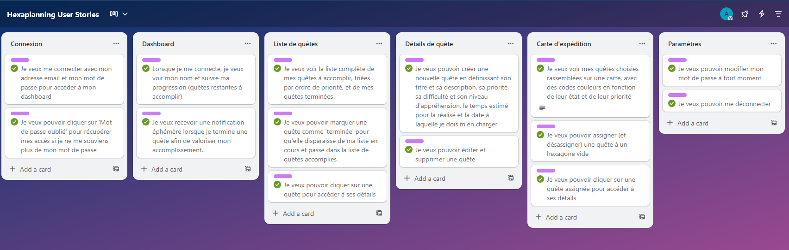
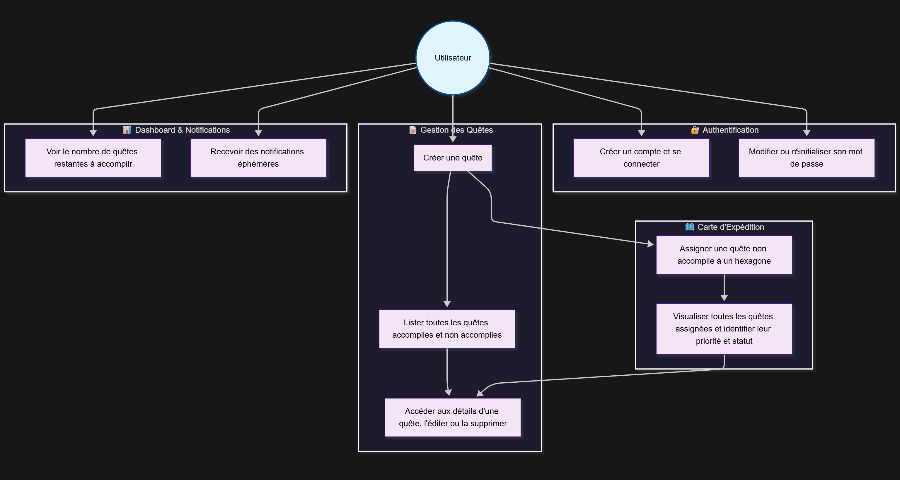
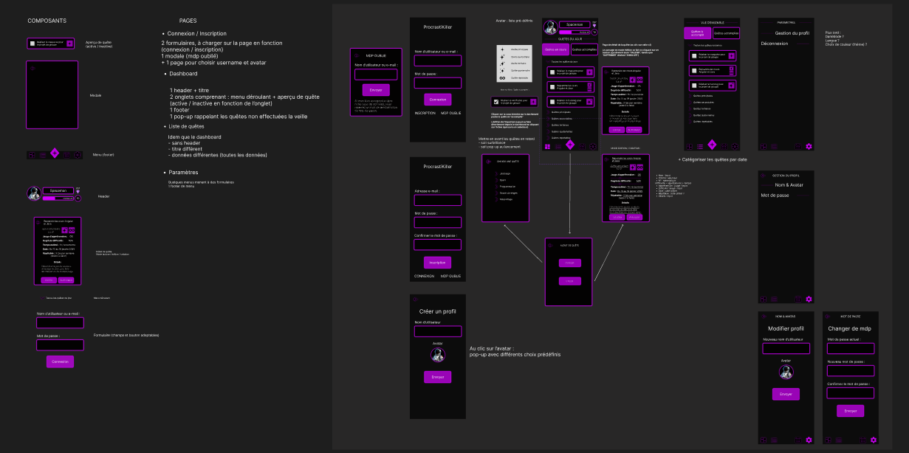

<!-- vscode-markdown-toc -->

# Table des matières

**I. [Introduction](#i-introduction)**

1.  [Présentation du projet](#i-1-présentation-du-projet)
2.  [Objectifs et contexte](#i-2-objectifs-et-contexte)

**II. [Spécifications du projet](#ii-spécifications-du-projet)**

1.  [Spécifications fonctionnelles](#ii-1-spécifications-fonctionnelles)
2.  [Spécifications techniques](#ii-2-spécifications-techniques)

**III. [Fonctionnalités principales](#iii-fonctionnalités-principales)**

1.  [Page d'accueil](#iii-1-page-d-accueil)
2.  [Gestion des quêtes (tâches)](#iii-2-gestion-des-quêtes-tâches)
3.  [Affichage visuel en hexagones (carte)](#iii-3-affichage-visuel-en-hexagones-map)
4.  [Système d'authentification et gestion des utilisateurs](#iii-4-système-d-authentification-et-gestion-des-utilisateurs)
5.  [Navigation et ergonomie](#iii-5-navigation-et-ergonomie)

**IV. [Travail en équipe & méthodologie](#iv-travail-en-équipe-méthodologie)**

1.  [Méthode Agile / Scrum](#iv-1-méthode-agile-scrum)
2.  [Workflow & branches stratégie](#iv-2-workflow-branches-stratégie)
3.  [Outils collaboratifs](#iv-3-outils-collaboratifs)
4.  [Communication & organisation de l'équipe](#iv-4-communication-organisation-équipe)

**V. [Modélisation des données](#v-modélisation-des-données)**

1.  [MCD (Modèle Conceptuel de Données)](#v-1-mcd-modèle-conceptuel-de-données)
2.  [MLD (Modèle Logique de Données)](#v-2-mld-modèle-logique-de-données)
3.  [Description des entités et relations](#v-3-description-des-entités-et-relations)

**VI. [Architecture technique et technologies](#vi-architecture-technique-et-technologies)**

1.  [Vue d'ensemble](#vi-1-vue-d-ensemble)
    - [Schéma global](#vi-1-1-schéma-global)
2.  [Frontend : Angular et PrimeNG](#vi-2-frontend-angular-et-primeng)
3.  [Backend : .NET Core](#vi-3-backend-net-core)
4.  [Base de données : PostgreSQL](#vi-4-base-de-données-postgresql)
5.  [Communication API REST](#vi-5-communication-api-rest)
6.  [Infrastructure et DevOps](#vi-6-infrastructure-et-devops)
7.  [Services externes](#vi-7-services-externes)
8.  [Sécurité et bonnes pratiques](#vi-8-sécurité-et-bonnes-pratiques)

**VII. [Qualité logicielle et tests](#vii-qualité-logicielle-et-tests)**

1.  [Tests unitaires (backend)](#vii-1-tests-unitaires-backend)
2.  [Tests d’intégration](#vii-2-tests-d-intégration)
3.  [Tests de charge et fixtures](#vii-3-tests-de-charge-et-fixtures)
4.  [Stratégie de validation](#vii-4-stratégie-de-validation)

**VIII. [CI / CD](#viii-ci-cd)**

1.  [Intégration continue (CI) de l’API](#viii-1-intégration-continue)
2.  [Déploiement continu (CD) du backend](#viii-2-déploiement-continu)
3.  [Conteneurisation et orchestration](#viii-3-conteneurisation-et-orchestration)
4.  [Hébergement et reverse proxy](#viii-4-hébergement-et-reverse-proxy)

**IX. [Sécurité](#ix-sécurité)**

1.  [Authentification et gestion des accès](#ix-1-authentification-et-gestion-des-accès)
2.  [Validation et intégrité des données](#ix-2-validation-et-intégrité-des-données)
3.  [Protection contre les attaques](#ix-3-protection-contre-les-attaques)
4.  [Sécurité de la conteneurisation et du déploiement](#ix-4-sécurité-de-la-conteneurisation-et-du-déploiement)
5.  [Surveillance et audit](#ix-5-surveillance-et-audit)

**X. [Accessibilité et conformité RGAA](#x-accessibilité-et-conformité-rgaa)**

1.  [Conformité RGAA et standards d'accessibilité](#x-1-conformité-rgaa-et-standards-d-accessibilité)
2.  [Accessibilité des formulaires](#x-2-accessibilité-des-formulaires)
3.  [Navigation au clavier et focus management](#x-3-navigation-au-clavier-et-focus-management)
4.  [Technologies d'assistance et lecteurs d'écran](#x-4-technologies-d-assistance-et-lecteurs-d-écran)

**XI. [Conception et analyse](#xi-conception-et-analyse)**

1.  [Analyse des besoins](#xi-1-analyse-des-besoins)
2.  [Maquettage et design](#xi-2-maquettage-et-design)
3.  [Composants métier](#xi-3-composants-métier)
4.  [Interfaces utilisateur](#xi-4-interfaces-utilisateur)

**XII. [Procédures de déploiement](#xii-procédures-de-déploiement)**

1.  [Plan de tests complet](#xii-1-plan-de-tests-complet)
2.  [Environnements de test](#xii-2-environnements-de-test)
3.  [Procédures de déploiement](#xii-3-procédures-de-déploiement)
4.  [Scripts et automatisation](#xii-4-scripts-et-automatisation)

**XIII. [Conclusion et perspectives](#xiii-conclusion-et-perspectives)**

1.  [Bilan du projet](#xiii-1-bilan-du-projet)
2.  [Perspectives d'évolution](#xiii-2-perspectives-d-évolution)
3.  [Améliorations futures possibles](#xiii-3-améliorations-futures)
4.  [Ce que ce projet m'a apporté](#xiii-4-apport-projet)

---

---

# I. Introduction

## 1. <a name='Prsentationduprojet'></a>Présentation du projet

Hexaplanning est une application web de gestion de tâches, pensée pour transformer la to-do list classique en une expérience visuelle et ludique. Reprenant la nomenclature des jeux-vidéos, les tâches sont appelées "quêtes". Chacune d'entre elles peut être placée sur une carte d’hexagones, permettant à l’utilisateur de visualiser ses objectifs comme un parcours à accomplir.

Cette approche vise à rendre la planification plus motivante et interactive, en s’inspirant des mécaniques de jeu et de la gamification. Hexaplanning est destinée tout particulièrement aux personnes sujètes à un trouble de l'attention et ayant de la difficulté à se concentrer sur une tâche à la fois.

L'application a été développée en mobile-first, favorisant une utilisation quotidienne permettant à l'utilisateur d'avoir un aperçu de sa progression et de la mettre à jour régulièrement. Elle est bien entendu accessible également sur ordinateur, et l'utilisateur pourra se créer un compte pour accéder à sa progression depuis n'importe quel appareil.

## 2. <a name='Objectifsetcontexte'></a>Objectifs et contexte

Le projet est né du constat que la gestion des tâches peut rapidement devenir monotone et décourageante, surtout lorsqu’elle se limite à une simple liste. Hexaplanning propose une alternative visuelle et dynamique, où chaque utilisateur peut organiser ses quêtes selon ses priorités et ses envies, tout en bénéficiant d’un suivi clair de sa progression. L’application s’adresse à toute personne souhaitant mieux organiser son temps, que ce soit dans un cadre personnel, scolaire ou professionnel, et met l’accent sur l’ergonomie, la sécurité et la personnalisation de l’expérience.

# II. Spécifications du projet

## 1. <a name='ii-1-spécifications-fonctionnelles'></a> Spécifications fonctionnelles

### Fonctionnalités principales

- **Gestion des utilisateurs** : Inscription, connexion, changement et réinitialisation de mot de passe.
- **Gestion des quêtes** : Création, modification, suppression, changement rapide de statut.
- **Système de priorités** : Classification en trois niveaux (primaire, secondaire, tertiaire).
- **Visualisation hexagonale** : Assignation des quêtes sur une carte d'hexagones.
- **Suivi de progression** : Barre de progression et pourcentage d'avancement.

### Cas d'usage (User Stories)

<div align="center">

</div>

<div align="center">
<em>User Stories en tant qu'utilisateur, réalisées avec Trello.</em>
</div>

#### Diagramme de cas d'usage

<div align="center">

</div>

<div align="center">
<em>Diagramme de cas d'usage, réalisé avec Mermaid.</em>
</div>

**Analyse des cas d'usage :**

1. **Authentification (🔐)** : Gestion complète de l'accès utilisateur avec sécurisation des mots de passe
2. **Gestion des Quêtes (📝)** : CRUD complet sur les tâches avec gestion des statuts et priorités
3. **Carte d'Expédition (🗺️)** : Visualisation sur une carte composée d'hexagones,avec assignation interactive
4. **Dashboard & Notifications (📊)** : Vue d'ensemble et notifications éphémères après chaque action

### Maquette (Figma)

<div align="center">

</div>

<div align="center">
<em>Version de départ de la maquette, réalisée avec Figma.</em>
</div>

### Objectifs pédagogiques du projet

- Développement d'une application web complète (frontend/backend)
- Mise en pratique des technologies modernes (Angular, .NET Core, PostgreSQL)
- Intégration de bonnes pratiques de développement (tests, CI/CD, sécurité)

## 2. <a name='ii-2-spécifications-techniques'></a> Spécifications techniques

### Technologies et frameworks utilisés

**Frontend :**

- Angular 18 avec TypeScript
- PrimeNG pour les composants UI
- SCSS pour le styling responsive
- Jest et Cypress pour les tests

**Backend :**

- ASP.NET Core 8 avec C#
- Entity Framework Core pour l'ORM
- PostgreSQL comme base de données
- ASP.NET Identity pour l'authentification

### Choix des langages et frameworks

- **Angular** : Framework mature avec une large communauté, TypeScript intégré
- **ASP.NET Core** : Performance élevée, sécurité intégrée, cross-platform
- **PostgreSQL** : SGBD relationnel open-source, robuste et performant

### Outils de développement

- **Visual Studio Code** : IDE pour le front-end avec extensions spécialisées
- **Visual Studio** : IDE pour le back-end
- **Swagger** : Documentation et accessibilité des endpoints de l'API

### Outils d'environnement (CI, Git, GitHub, Jest, Docker, Maven, Node.js, Navigateurs...)

- **Git/GitHub** : Contrôle de version et collaboration
- **GitHub Actions** : Intégration et déploiement continus
- **Docker** : Conteneurisation des services (frontend, backend, base de données)
- **Node.js** : Runtime pour les outils de build Angular
- **npm** : Gestionnaire de packages JavaScript
- **Navigateurs** : Chrome et Firefox pour les tests cross-browser

# III. Fonctionnalités principales

## 1. <a name='PagedAccueil'></a>Page d'accueil

<div align="center">

</div>

<div align="center">
<em>Page d'accueil d'Hexaplanning.</em>
</div>

La page d'accueil apparaît dès la connexion de l'utilisateur, et affiche le nombre de quêtes qu'il lui reste à accomplir

## 2. <a name='Gestiondesqutestches'></a>Gestion des quêtes (tâches)

Les tâches, appelées "quêtes", sont au cœur de l’application. Chaque quête possède un titre, un statut (en attente, en cours et terminée) et une priorité (primaire, secondaire ou tertiaire, avec une icône et un code couleur associés), ainsi qu’une description et un temps estimé en option, ainsi qu'un pourcentage de progression (associé à une barre de progression) dans le cas des quêtes en cours. L’utilisateur peut créer, éditer ou supprimer une quête, la marquer rapidement comme terminée ou la remettre en attente, et l'associer à un hexagone sur la carte prévue à cet effet.

<div align="center">

</div>

<div align="center">
<em>Modale de détails d'une quête.</em>
</div>
<br />

<div align="center">

</div>

<div align="center">
<em>Edition d'une quête existante.</em>
</div>
<br />

<div align="center">

</div>

<div align="center">
<em>Modale de suppression d'une quête.</em>
</div>

Un affichage standard des quêtes est proposé aux utilisateurs, sous forme de deux listes : l'une pour les quêtes à accomplir, l'autre pour les quêtes accomplies. La navigation se fait via un menu composé de deux onglets. Les quêtes à accomplir sont triées par ordre de priorité.

<div align="center">

</div>

<div align="center">
<em>Liste des quêtes non accomplies.</em>
</div>
<br />

<div align="center">

</div>

<div align="center">
<em>Listes des quêtes accomplies.</em>
</div>
<br />

<div align="center">

</div>

<div align="center">
<em>Toast de succès : quête accomplie.</em>
</div>

Sur ces listes, l'utilisateur peut voir d'un coup d'oeil le titre de chaque quête ainsi qu'une icône représentant sa priorité, doublée d'un code couleur (orangé pour les principales, argenté pour les secondaires, gris foncé pour les tertiaires). Il dispose également d'un bouton à cocher pour aisément marquer une quête comme accomplie - ce qui déclenche un toast de succès - ou au contraire réhabiliter une quête terminée. Si la quête est indiquée comme "en cours", la barre de progression s'affiche directement sur l'aperçu de la quête, la remplissant progressivement d'une couleur plus sombre. Les quêtes terminées sont entièrement remplies.

## 3. <a name='Affichagevisuelenhexagonesmap'></a>Affichage visuel en hexagones (carte)

L’originalité d’Hexaplanning réside dans sa représentation visuelle : une carte d’hexagones sur laquelle l’utilisateur peut placer ses quêtes. Chaque hexagone peut accueillir une quête, et un code couleur sur le liseré permet d’identifier rapidement sa priorité (orangé pour les principales, argenté pour les secondaires, et aucun liseré pour les tertiaires). Les quêtes terminées apparaissent avec un fond plus sombre, et les quêtes en cours disposent d'une barre de progression radiale qui remplit progressivement l'hexagone avec cette couleur, à la manière d'une horloge.

<div align="center">

</div>

<div align="center">
<em>Page de la carte d'hexagones.</em>
</div>

L'utilisateur peut assigner une quête en cliquant ou appuyant sur un hexagone vide, faisant apparaître une modale contenant la liste de toutes les quêtes non accomplies, et en sélectionnant la quête de son choix. Il pourra ensuite la désassigner d'un simple clic sur l'icône de croix au-dessus du titre de la quête, ce qui déclenchera une modale de confirmation.

<div align="center">

</div>

<div align="center">
<em>Modale d'assignation d'une quête à un hexagone.</em>
</div>
<br />

<div align="center">

</div>

<div align="center">
<em>Modale de désassignation d'une quête à un hexagone.</em>
</div>

Tout comme sur les listes des quêtes, il suffit de cliquer ou d'appuyer sur un hexagone associé à une quête pour afficher les détails de la quête en question, et éventuellement modifier ou supprimer la quête (ce qui la fera disparaître de la carte et des listes).

## 4. <a name='Systmedauthentificationetgestiondesutilisateurs'></a>Système d'authentification et gestion des utilisateurs

L’accès à l’application nécessite la création d’un compte et une authentification sécurisée. L'utilisateur devra accepter les CGU et la politique de confidentialité, accessibles via des liens sur le formulaire de création de compte. Le mot de passe choisi devra respecter les normes standard : au minimum 8 caractères dont 1 lettre majuscule, 1 lettre minuscule, 1 chiffre et 1 caractère spécial. Après son enregistrement, l'utilisateur sera redirigé vers la page de connexion, et il peut aisément naviguer entre la connexion et la création de compte via un lien en bas de page.

<div align="center">

</div>

<div align="center">
<em>Page de création de compte.</em>
</div>
<br />

<div align="center">

</div>

<div align="center">
<em>Page de connexion.</em>
</div>

Un système de gestion des mots de passe oubliés est en place, avec envoi d'email pour la réinitialisation. Lorsque l'utilisateur clique sur "mot de passe oublié", une modale s'ouvre. Si l'utilisateur avait déjà rentré son adresse e-mail dans le champ de connexion, il sera automatiquement reporté dans le champ de la modale. Au clic sur le bouton d'envoi, un toast informe l'utilisateur qu'un mail a été délivré à l'adresse indiquée, si elle existe. En effet, il s'agit de ne pas confirmer ou infirmer la présence de cette adresse e-mail dans la base de données. De plus, il ne peut y avoir qu'une seule requête vers la même adresse toutes les 5 minutes, afin d'éviter le spam d'une adresse e-mail et la saturation du service de mail.

<div align="center">

</div>

<div align="center">
<em>Modale de mot de passe oublié.</em>
</div>

Le destinataire recevera un mail contenant un lien de réinitialisation de mot de passe. Ce lien le redirigera vers la page prévue à cet effet, avec dans l'url un token valable une heure, et l'adresse e-mail du compte à modifier. Sans ces deux éléments valides, la requête ne pourra être acceptée. L'utilisateur n'a plus qu'à rentrer son nouveau mot de passe et à le confirmer, avant d'être redirigé vers la page de connexion.

<div align="center">

</div>

<div align="center">
<em>Mail de réinitialisation de mot de passe.</em>
</div>
<br />

<div align="center">

</div>

<div align="center">
<em>Page de réinitialisation de mot de passe.</em>
</div>

L'utilisateur peut également changer son mot de passe depuis l'interface : en accédant au menu des paramètres, il aura la possibilité d'ouvrir une modale lui demandant son mot de passe actuel ainsi que le nouveau. Depuis ce même menu, il pourra se déconnecter de l'application.

<div align="center">

</div>

<div align="center">
<em>Page de paramètres.</em>
</div>
<br />

<div align="center">

</div>

<div align="center">
<em>Modale de changement de mot de passe.</em>
</div>
<br />

<div align="center">

</div>

<div align="center">
<em>Modale de déconnexion.</em>
</div>

La sécurité des données et la protection contre les accès non autorisés sont assurées par des mécanismes robustes côté backend.

<!-- TODO : A développer (dans une autre section ?) -->

## 5. <a name='Navigationetergonomie'></a>Navigation et ergonomie

L’application propose un menu apparaissant en permanence en bas de page, et permettant de naviguer entre l’accueil, les listes de quêtes, la carte des hexagones et les paramètres. Un bouton dédié au centre du menu permet de créer rapidement une nouvelle quête, qui viendra s'insérer dans la liste qui lui correspond, et sera accessible dans la modale d'assignation à un hexagone.

<div align="center">

</div>

<div align="center">
<em>Modale de création de quête.</em>
</div>

L'interface est pensée pour être intuitive, responsive et agréable à utiliser, afin de maximiser l'engagement et la productivité de l'utilisateur.

# IV. Travail en équipe & méthodologie

## 1. <a name='iv-1-méthode-agile-scrum'></a> Méthode Agile / Scrum

### Méthodologie adoptée

Le projet Hexaplanning a été développé tout d'abord en collaboration, puis en solo. La méthode Agile a été adoptée au fil du projet :

- **Sprints de 2 semaines** : Cycles de développement courts et itératifs
- **User Stories** : Fonctionnalités définies du point de vue utilisateur
- **Backlog Product** : Priorisation des fonctionnalités selon la valeur métier
- **Daily Standup** : Points quotidiens sur l'avancement (adaptés selon disponibilité)

### Découpage du projet

**Sprint 1 : Fondations**

- Réalisation du wireframe et de la maquette
- Mise en place des User Stories
- Configuration de l'environnement de développement
- Architecture de base (frontend Angular + backend .NET)
- Authentification et gestion des utilisateurs

**Sprint 2 : Fonctionnalités core**

- CRUD des quêtes
- Système de priorités et statuts
- Interface de liste des quêtes

**Sprint 3 : Visualisation**

- Développement de la carte hexagonale
- Assignation des quêtes aux hexagones
- Interactions et animations

**Sprint 4 : Finalisation**

- Tests et corrections de bugs
- Documentation
- Déploiement et mise en production

## 2. <a name='iv-2-workflow-branches-stratégie'></a> Workflow & branches stratégie

### Git Workflow adopté

**Stratégie de branching :**

- **main** : Branche de production, code stable
- **develop** : Branche de développement, intégration des features
- **feature/** : Branches pour chaque nouvelle fonctionnalité
- **hotfix/** : Corrections urgentes sur la production

### Processus de développement

```bash
# Création d'une nouvelle feature
git checkout develop
git pull origin develop
git checkout -b feature/quest-management

# Développement et commits
git add .
git commit -m "feat: add quest creation functionality"

# Push et Pull Request
git push origin feature/quest-management
# Création PR sur GitHub : feature/quest-management -> develop
```

### Code Review

- **Pull Requests obligatoires** : Aucun code ne merge sans review
- **Critères de validation** : Tests passants, documentation, respect des conventions
- **Reviewers** : Au moins un autre développeur valide les modifications

## 3. <a name='iv-3-outils-collaboratifs'></a> Outils collaboratifs

### Gestion de projet

- **Jira** : Tableau Kanban pour le suivi des tâches

### Communication

- **Discord** : Communication instantanée de l'équipe

### Documentation partagée

- **Figma** : Maquettes et schémas d'architecture collaboratifs
- **Confluence/Notion** : Spécifications fonctionnelles et notes de réunion

# V. Modélisation des données

## 1. <a name='MCDModleConceptueldeDonnes'></a>MCD (Modèle Conceptuel de Données)

<div align="center">

</div>

<div align="center">
<em>Schéma de la base de données relationnelle d'Hexaplanning, réalisé avec dbdiagram.io.</em>
</div>

## 2. <a name='MLDModleLogiquedeDonnes'></a>MLD (Modèle Logique de Données)

- Table **UserApp** (Id PK, FirstName, LastName, Email, PasswordHash, CreatedAt, UpdatedAt, IsArchived, ...)
- Table **Quest** (Id PK, Title, Description, EstimatedTime, Advancement, UserId FK, PriorityId FK, StatusId FK, HexAssignmentId FK, CreatedAt, UpdatedAt, IsArchived)
- Table **Priority** (Id PK, Name, Color, BorderColor, Icon, CreatedAt, UpdatedAt, IsArchived)
- Table **Status** (Id PK, Name, Color, Icon, CreatedAt, UpdatedAt, IsArchived)
- Table **HexAssignment** (Id PK, Q, R, S, QuestId FK, CreatedAt, UpdatedAt, IsArchived)
- Table **Mail** (MailTo, MailSubject, MailBody, MailFrom, Receiver)

## 3. <a name='Descriptiondesentitsetrelations'></a>Description des entités et relations

### UserApp (Utilisateur)

- Un utilisateur peut créer plusieurs quêtes.
  Il possède :
  - Un nom et un prénom.
  - Une adresse e-mail unique.
  - Un mot de passe (hashé dans la base de données).
  - Une liste de quêtes.
  - Des métadonnées : date de création, date de mise à jour, statut d'archivage.

### Quest (Quête)

- Une quête appartient à un seul utilisateur.
  Elle possède :
  - Un titre (limité à 100 caractères).
  - Optionnellement, une description.
  - Optionnellement, un temps estimé.
  - Un pourcentage d'avancement (Advancement) pour les quêtes en cours.
  - Un UserId pour la rattacher à son utilisateur.
  - Un PriorityId pour définir sa priorité.
  - Un StatusId pour définir son statut.
  - Optionnellement, un HexAssignmentId pour l'assigner à un hexagone.
  - Des métadonnées : date de création, date de mise à jour, statut d'archivage.

### Priority (Priorité)

- Une priorité peut être associée à plusieurs quêtes.
  Elle possède :
  - Un nom (PRIMARY, SECONDARY, TERTIARY).
  - Une couleur principale.
  - Une couleur de bordure (BorderColor) pour l'affichage sur la carte.
  - Optionnellement, une icône.
  - Des métadonnées : date de création, date de mise à jour, statut d'archivage.

### Status (Statut)

- Un statut peut être associé à plusieurs quêtes.
  Il possède :
  - Un nom (en attente, en cours, terminée).
  - Une couleur pour l'affichage.
  - Optionnellement, une icône.
  - Des métadonnées : date de création, date de mise à jour, statut d'archivage.

### HexAssignment (Assignation d'hexagone)

- Un hexagone (HexAssignment) est lié à une seule quête.
  Il possède :
  - Un jeu de coordonnées q, r, s qui lui est unique (système de coordonnées hexagonales).
  - Un QuestId pour la quête assignée.
  - Des métadonnées : date de création, date de mise à jour, statut d'archivage.

### Mail

- Un mail est indépendant et permet d'envoyer des communications (réinitialisation de mot de passe, bienvenue, etc.).
  Il possède :
  - Un destinataire (MailTo).
  - Un sujet (MailSubject).
  - Un corps de message (MailBody).
  - Un expéditeur (MailFrom).
  - Un destinataire lié à un utilisateur (Receiver).

### Relations principales :

- **UserApp 1:N Quest** : Un utilisateur possède plusieurs quêtes.
- **Quest N:1 Priority** : Une quête a une priorité.
- **Quest N:1 Status** : Une quête a un statut.
- **Quest 1:1 HexAssignment** : Une quête peut être assignée à un hexagone (optionnel).

# VI. Architecture technique et technologies

## 1. <a name='vi-1-vue-d-ensemble'></a> Vue d'ensemble

Hexaplanning adopte une architecture moderne en trois couches (3-tier architecture) avec une séparation claire des responsabilités. Le choix des technologies s'est fait en privilégiant la robustesse, la maintenabilité et l'écosystème de chaque solution. L'architecture repose sur :

- **Frontend** : Angular 18 avec PrimeNG pour une interface utilisateur moderne et responsive
- **Backend** : ASP.NET Core 8 pour une API REST performante et sécurisée
- **Base de données** : PostgreSQL pour la persistance des données
- **Infrastructure** : Docker et GitHub Actions pour le déploiement et l'intégration continue
- **Services externes** : Brevo pour l'envoi d'e-mails transactionnels

Cette approche modulaire facilite la maintenance, l'évolutivité et la sécurité de l'application. La communication entre les couches s'effectue via une API REST sécurisée par JWT.

### <a name='Schmaglobal'></a>Schéma global

<div align="center">

</div>

<div align="center">
<em>Schéma global de l'architecture d'Hexaplanning.</em>
</div>

## 2. <a name='FrontendAngularetPrimeNG'></a> Frontend : Angular et PrimeNG

### Choix technologiques et justifications

- **Angular 18** : Framework SPA reconnu pour sa structure modulaire, sa maintenabilité et sa communauté active. Il facilite la création d'interfaces dynamiques, responsives et testables. Le choix de la version 18 apporte les dernières optimisations de performance et les nouveautés du framework.

- **PrimeNG** : Bibliothèque de composants UI riche et moderne pour Angular, fournissant les éléments d'interface (modales, formulaires, boutons, toasts) avec un design cohérent et professionnel. Alternative considérée : Angular Material, mais PrimeNG offre plus de composants spécialisés out-of-the-box.

- **TypeScript** : Apporte la sécurité de typage et la clarté du code, essentielle pour un projet d'envergure. Facilite la maintenance et réduit les erreurs de développement.

### Architecture et organisation

- **Structure modulaire** : Organisation en modules fonctionnels (auth, quest, hexagon, settings), composants, services et modèles TypeScript
- **Approche mobile-first** : Interface responsive optimisée pour les appareils mobiles
- **State management** : Services Angular pour la gestion d'état partagé

### Responsabilités principales

- Gestion de l'interface utilisateur et de l'expérience utilisateur
- Navigation entre les différentes pages et modales
- Appels API vers le backend et gestion des réponses
- Gestion du token JWT pour l'authentification
- Affichage dynamique de la carte d'hexagones avec coordonnées hexagonales
- CRUD des quêtes avec validation côté client

### Sécurité

- **Intercepteur HTTP** : Ajout automatique du JWT dans toutes les requêtes API
- **Guards de navigation** : Protection des routes sensibles (authentification requise)
- **Validation des formulaires** : Contrôles côté client avant envoi au backend

### Tests et qualité

- **Jest** : Tests unitaires des composants et services
- **Cypress** : Tests end-to-end pour valider les parcours utilisateur complets
- **ESLint** : Analyse statique du code pour maintenir la qualité

## 3. <a name='BackendNETCore'></a> Backend : .NET Core

### Choix technologiques et justifications

- **ASP.NET Core 8** : Framework backend performant, sécurisé et multiplateforme, idéal pour exposer une API REST robuste et scalable. La version 8 LTS garantit la stabilité et le support à long terme.

- **Entity Framework Core** : ORM facilitant la gestion et la migration de la base de données, tout en assurant la cohérence des modèles. Alternative considérée : Dapper, mais EF Core offre une approche Code-First plus adaptée au projet.

- **ASP.NET Identity** : Système d'authentification et d'autorisation intégré, robuste et éprouvé pour la gestion des utilisateurs et des mots de passe.

### Architecture en couches

L'API suit une architecture en couches claire pour séparer les responsabilités :

- **Controllers** : Points d'entrée API, gestion des requêtes HTTP et des réponses
- **Services** : Logique métier, règles de gestion et orchestration des opérations
- **Models** : Entités de domaine et DTOs pour le transfert de données
- **DataContext** : Couche d'accès aux données avec Entity Framework
- **Utilities** : Classes utilitaires et helpers transversaux

### Responsabilités principales

- **API RESTful** : Exposition des endpoints pour toutes les opérations CRUD
- **Authentification JWT** : Génération et validation des tokens d'authentification
- **Logique métier** : Création/gestion des quêtes, hexagones, utilisateurs, priorités, statuts
- **Validation des données** : Contrôles de cohérence et de sécurité des données
- **Envoi d'e-mails** : Service intégré s'appuyant sur Brevo pour les notifications (réinitialisation de mot de passe, bienvenue)

### Sécurité intégrée

- **Middleware JWT** : Authentification automatique sur tous les endpoints protégés
- **Validation des entrées** : Contrôles stricts sur toutes les données reçues
- **Gestion des droits** : Chaque utilisateur n'accède qu'à ses propres données
- **Protection anti-attaques** : Guards contre l'injection SQL, XSS, CSRF
- **Rate limiting** : Protection contre les tentatives de force brute

### Tests et qualité

- **xUnit** : Framework de tests unitaires moderne et flexible, intégré à l'écosystème .NET
- **Tests d'intégration** : Validation complète des endpoints avec base de données de test
- **Testcontainers** : Tests sur PostgreSQL réel pour une validation authentique

## 4. <a name='BasededonnesPostgreSQL'></a> Base de données : PostgreSQL

### Choix technologique et justifications

- **PostgreSQL** : SGBD open source reconnu pour sa fiabilité, ses performances et ses capacités avancées (transactions ACID, indexation complexe, support JSON, etc.). Alternatives considérées : MySQL (moins de fonctionnalités avancées), SQL Server (coût des licences).

### Modélisation et structure

- **Respect du MCD/MLD** : Implementation fidèle du modèle conceptuel présenté au chapitre III
- **Relations normalisées** : Base de données en 3ème forme normale pour éviter la redondance
- **Entités principales** : UserApp, Quest, Priority, Status, HexAssignment, Mail
- **Contraintes d'intégrité** : Clés étrangères, contraintes CHECK et UNIQUE pour la cohérence des données

### Gestion et évolution

- **Migrations Entity Framework Core** : Versioning automatique du schéma de base de données
- **Code-First approach** : Génération du schéma à partir des modèles C#
- **Seeding** : Données initiales (priorités, statuts) injectées automatiquement
- **Backup et restauration** : Stratégies de sauvegarde régulières en production

### Performance et optimisation

- **Indexation** : Index sur les clés étrangères et champs de recherche fréquents
- **Requêtes optimisées** : Utilisation d'LINQ pour des requêtes efficaces
- **Connection pooling** : Gestion optimale des connexions base de données

### Sécurité

- **Accès restreint** : Connexion uniquement via l'API backend, aucun accès direct
- **Chiffrement** : Connexions SSL/TLS obligatoires
- **Isolation des données** : Chaque utilisateur accède uniquement à ses propres données
- **Credentials sécurisés** : Mots de passe hashés avec ASP.NET Identity

## 5. <a name='CommunicationAPIREST'></a> Communication API REST

### Architecture RESTful

- **Format de données** : JSON via HTTP(S) pour tous les échanges
- **Verbes HTTP** : Utilisation sémantique (GET, POST, PUT, DELETE)
- **Codes de réponse** : Status codes HTTP appropriés (200, 201, 400, 401, 404, 500)
- **Structure des URLs** : Routes RESTful cohérentes (`/api/quests`, `/api/users/{id}`)

### Endpoints principaux

- **Authentification** : `/api/auth/login`, `/api/auth/register`, `/api/auth/reset-password`
- **Gestion des quêtes** : CRUD complet sur `/api/quests` avec filtrage par utilisateur
- **Gestion des hexagones** : `/api/hexassignments` pour l'assignation des quêtes
- **Gestion des utilisateurs** : `/api/users` pour les profils et paramètres
- **Données de référence** : `/api/priorities`, `/api/statuses` pour les listes déroulantes

### Sécurité et authentification

- **JWT Bearer Token** : Toutes les routes sensibles protégées par authentification
- **CORS configuré** : Origines autorisées limitées aux domaines de l'application
- **Rate limiting** : Protection contre les abus et attaques par déni de service
- **Validation des données** : Contrôles stricts sur tous les inputs API

### Gestion des erreurs

- **Réponses structurées** : Format JSON consistent pour les erreurs
- **Messages explicites** : Informations claires pour le débogage côté frontend
- **Logs centralisés** : Traçabilité complète des erreurs serveur

## 6. <a name='InfrastructureetDevOps'></a> Infrastructure et DevOps

### Conteneurisation

- **Docker** : Conteneurisation de chaque composant pour garantir la portabilité, l'isolation et la reproductibilité des environnements. Chaque service (frontend, backend, base de données) dispose de son propre Dockerfile optimisé.

- **docker-compose** : Orchestration simplifiée du déploiement multi-conteneurs. Gestion des dépendances entre services, des variables d'environnement et des volumes persistants.

### Intégration et déploiement continu

- **GitHub Actions** : Automatisation des pipelines CI/CD pour des livraisons rapides et sûres. Pipelines séparés pour le frontend et le backend avec tests automatisés.

- **Workflow CI** : Tests unitaires et d'intégration automatiques avant chaque déploiement
- **Workflow CD** : Build, push vers Docker Hub et déploiement automatique sur le VPS

### Hébergement et infrastructure

- **OVH VPS** : Hébergement flexible et sécurisé, adapté à la montée en charge. Serveur Linux Ubuntu avec Docker et docker-compose installés.

- **Nginx Proxy Manager** : Gestion centralisée des domaines, des certificats SSL et du reverse proxy. Interface web pour la configuration des routes et des certificats Let's Encrypt automatiques.

### Monitoring et maintenance

- **Logs centralisés** : Collecte et analyse des logs applicatifs pour le debugging
- **Health checks** : Surveillance de l'état des services Docker
- **Backup automatique** : Sauvegardes régulières de la base de données
- **Mises à jour sécurisées** : Processus de mise à jour des dépendances et images Docker

## 7. <a name='Servicesexternes'></a> Services externes

### Brevo (ex-Sendinblue)

- **Service d'emailing transactionnel** : Solution cloud fiable et simple à intégrer pour l'envoi d'e-mails automatisés
- **Utilisation** : Envoi de mails de réinitialisation de mot de passe, messages de bienvenue, notifications importantes
- **Avantages** : API simple, bonne délivrabilité, tarification adaptée aux petits volumes
- **Alternative considérée** : SendGrid, mais Brevo offre une interface plus intuitive et des tarifs plus avantageux pour un projet de cette envergure

### Justification du choix

L'externalisation de l'envoi d'e-mails vers Brevo permet :

- **Fiabilité** : Infrastructure spécialisée avec haute disponibilité
- **Délivrabilité** : Réputation IP préservée et conformité aux standards anti-spam
- **Simplicité** : Pas de gestion de serveur SMTP interne
- **Coût** : Solution économique par rapport à l'hébergement d'un serveur mail

## 8. <a name='Scuritetbonnespratiques'></a> Sécurité et bonnes pratiques

L'application implémente une stratégie de sécurité multicouche couvrant l'authentification, la protection des données et la sécurisation de l'infrastructure.

### Authentification et gestion des identités

- **ASP.NET Identity** : Framework robuste intégré à .NET Core pour la gestion complète des utilisateurs
- **JWT (JSON Web Tokens)** : Authentification stateless sécurisée avec signature cryptographique
- **Hachage des mots de passe** : Utilisation d'algorithmes sécurisés (PBKDF2) avec salage automatique
- **Réinitialisation sécurisée** : Tokens temporaires à usage unique pour la récupération de mot de passe
- **Validation d'email** : Confirmation d'identité via email avec tokens d'activation

### Protection contre les attaques web

- **CSRF Protection** : Tokens anti-contrefaçon sur toutes les opérations sensibles
- **XSS Prevention** : Échappement automatique des données utilisateur, Content Security Policy stricte
- **SQL Injection** : Utilisation d'Entity Framework avec requêtes paramétrées
- **Validation des entrées** : Sanitisation côté serveur et client avec Data Annotations
- **Rate Limiting** : Protection contre les attaques par déni de service et force brute

### Sécurité de l'infrastructure

- **HTTPS obligatoire** : Chiffrement TLS 1.2+ en production avec redirection automatique
- **Headers de sécurité** : HSTS, X-Frame-Options, X-Content-Type-Options, Referrer-Policy
- **CORS restrictif** : Configuration précise des origines autorisées pour les requêtes cross-origin
- **Isolation des conteneurs** : Docker avec utilisateurs non-privilégiés et réseaux isolés
- **Variables d'environnement** : Secrets stockés de manière sécurisée, jamais dans le code source

### Bonnes pratiques de développement

- **Principe du moindre privilège** : Accès limité aux ressources strictement nécessaires
- **Gestion des erreurs** : Messages d'erreur génériques pour éviter la fuite d'informations
- **Logging sécurisé** : Traçabilité des actions sensibles sans exposition de données personnelles
- **Mise à jour régulière** : Surveillance et application des correctifs de sécurité
- **Tests de sécurité** : Validation automatisée des vulnérabilités connues

Cette architecture garantit robustesse, évolutivité et sécurité, tout en permettant une expérience utilisateur fluide et moderne.

# VII. Qualité logicielle et tests

La qualité logicielle d’Hexaplanning repose sur une stratégie de tests complète, principalement concentrée sur l’API .NET, afin de garantir la robustesse, la fiabilité et la maintenabilité du backend.

## 1. <a name='Testsunitairesbackend'></a> Tests unitaires (backend)

Les tests unitaires sont réalisés avec xUnit et couvrent les principaux services métiers, notamment le service de gestion des quêtes (`QuestService`). Ces tests vérifient le bon fonctionnement des méthodes de création, lecture, mise à jour et suppression de quêtes, ainsi que la gestion des cas limites (identifiants invalides, absence de données, etc.).

Exemples de méthodes testées :

- Création d’une quête (`CreateQuestAsync`)
- Récupération d’une quête par ID (`GetQuestByIdAsync`)
- Mise à jour et suppression de quêtes (`UpdateQuestAsync`, `DeleteQuestAsync`)
- Récupération des quêtes selon leur statut (en attente, terminées, non assignées)

## 2. <a name='Testsdintgration'></a> Tests d’intégration

Des tests d’intégration automatisés valident l’ensemble du pipeline API, de la couche HTTP jusqu’à la base de données PostgreSQL (via Testcontainers). Ils simulent des scénarios réels, comme la récupération de quêtes via des requêtes authentifiées, la gestion des droits d’accès, et la cohérence des données persistées.

Caractéristiques :

- Utilisation de `WebApplicationFactory` pour lancer l’API en environnement de test
- Base de données PostgreSQL éphémère (Testcontainers)
- Données de test injectées automatiquement (utilisateur, quêtes)
- Vérification de la sécurité (JWT requis, accès refusé si non authentifié)

## 3. <a name='Testsdechargeetfixtures'></a> Tests de charge et fixtures

Des fixtures de données sont utilisées pour simuler des volumes importants de quêtes et d’utilisateurs, grâce à la librairie Bogus. Cela permet de valider la tenue en charge de l’API et la stabilité des traitements sur de grands ensembles de données. Les tests ont été réalisés avec 100000 utilisateurs et 1000000 de quêtes pour s'assurer de la robustesse de la base de données.

## 4. <a name='Stratgiedevalidation'></a> Stratégie de validation

Chaque nouvelle fonctionnalité ou correction de bug s’accompagne de tests dédiés. Les tests sont exécutés automatiquement lors des pipelines CI/CD (GitHub Actions), garantissant l’absence de régressions avant chaque déploiement. La couverture de code est régulièrement analysée pour cibler les zones à renforcer.

Cette démarche assure un haut niveau de confiance dans la qualité logicielle du backend, tout en facilitant l’évolution continue du projet.

# VIII. CI / CD

L’automatisation du déploiement et de l’intégration continue est assurée par des pipelines GitHub Actions distincts pour le frontend Angular et l’API .NET. Cette organisation garantit des mises en production fiables, rapides et reproductibles.

## 1. <a name='IntgrationcontinueCIdelAPI'></a> Intégration continue (CI) de l’API

Un pipeline CI dédié à l’API .NET s’exécute à chaque push sur la branche `main` :

- **Tests unitaires** : Compilation et exécution des tests unitaires (`dotnet test ./TestsUnitaires`)
- **Tests d’intégration** : Lancement des tests d’intégration sur une base PostgreSQL éphémère (`dotnet test ./TestsIntegration`)
- **Vérification de la qualité** : Toute régression ou échec bloque la suite du pipeline

Extrait du workflow :

```yaml
jobs:
   test-unitaire:
      ...
      - run: dotnet test --no-build --verbosity normal ./TestsUnitaires
   test-integration:
      ...
      - run: dotnet test --no-build --verbosity detailed  ./TestsIntegration
```

## 2. <a name='DploiementcontinuCDdubackend'></a> Déploiement continu (CD) du backend

Le backend .NET dispose également d’un pipeline CD automatisé. Celui-ci ne se déclenche que si le pipeline CI de l’API s’est terminé avec succès (`workflow_run`). Il effectue les étapes suivantes :

- **Build Docker** : Construction de l’image Docker de l’API
- **Push Docker** : Publication de l’image sur Docker Hub
- **Déploiement VPS** : Connexion SSH au serveur OVH, pull de la nouvelle image et redémarrage du conteneur backend via `docker compose`

Extrait du workflow :

```yaml
on:
   workflow_run:
      workflows: ["CI pipeline for the API"]
      types:
         - completed
jobs:
   build-and-deploy:
      ...
      - run: docker build -t antoinespr/hexaplanning-api:dev1 .
      - run: docker push antoinespr/hexaplanning-api:dev1
      - uses: appleboy/ssh-action@v1.0.0
         with:
            script: |
               docker pull antoinespr/hexaplanning-api:dev1
               docker compose -f /home/ubuntu/backend/docker-compose.yml up -d --force-recreate
```

Le frontend Angular dispose d’un pipeline CD qui automatise la construction, la publication et le déploiement sur le serveur de production :

- **Build Docker** : Construction de l’image Docker de l’application Angular
- **Push Docker** : Publication de l’image sur Docker Hub
- **Déploiement VPS** : Connexion SSH au serveur OVH, pull de la nouvelle image et redémarrage du conteneur via `docker compose`

Extrait du workflow :

```yaml
jobs:
   deploy:
      ...
      - run: docker build --target prod-runtime -t antoinespr/hexaplanning-front:dev1 .
      - run: docker push antoinespr/hexaplanning-front:dev1
      - uses: appleboy/ssh-action@v1.0.0
         with:
            script: |
               docker pull antoinespr/hexaplanning-front:dev1
               docker compose -f /home/ubuntu/frontend/docker-compose.yml up -d --force-recreate
```

## 3. <a name='DploiementcontinuCDdufrontend'></a> Déploiement continu (CD) du frontend

Le frontend Angular bénéficie d’un pipeline CD dédié, déclenché à chaque mise à jour de la branche principale. Ce pipeline prend en charge l’ensemble du cycle de livraison : il construit l’application en mode production, génère une image Docker optimisée, la publie sur Docker Hub, puis orchestre le déploiement sur le serveur distant. L’automatisation garantit que la dernière version du frontend est toujours disponible en production, sans intervention manuelle.

Le pipeline s’appuie sur GitHub Actions et utilise des secrets pour sécuriser l’accès au registre Docker et au serveur. L’étape de déploiement s’effectue via SSH, assurant un redémarrage fluide du conteneur frontend sans interruption de service pour les utilisateurs.

Extrait du workflow :

```yaml
jobs:
   deploy:
      ...
      - run: docker build --target prod-runtime -t antoinespr/hexaplanning-front:dev1 .
      - run: docker push antoinespr/hexaplanning-front:dev1
      - uses: appleboy/ssh-action@v1.0.0
         with:
            script: |
               docker pull antoinespr/hexaplanning-front:dev1
               docker compose -f /home/ubuntu/frontend/docker-compose.yml up -d --force-recreate
```

## 4. <a name='Conteneurisationetorchestration'></a> Conteneurisation et orchestration

Chaque composant (frontend, backend, base de données) dispose de son propre Dockerfile. Le déploiement s’effectue via `docker compose`, facilitant la gestion, la montée en charge et la maintenance.

## 5. <a name='Hbergementetreverseproxy'></a> Hébergement et reverse proxy

L’application est hébergée sur un VPS OVH, avec Nginx Proxy Manager pour la gestion des domaines et des certificats SSL. Cette architecture assure la sécurité, la disponibilité et la scalabilité du service.

Cette chaîne CI/CD garantit des livraisons rapides, sûres et automatisées, tout en limitant les interventions manuelles et les risques d’erreur.

Le résultat final est disponible sous le nom de domaine hexaplanning.fr.

# IX. Sécurité

La sécurité est un pilier central d’Hexaplanning, intégrée à tous les niveaux de l’architecture pour garantir la confidentialité, l’intégrité et la disponibilité des données utilisateurs.

## 1. <a name='Authentificationetgestiondesaccs'></a> Authentification et gestion des accès

- **JWT (JSON Web Token)** : Toutes les opérations sensibles nécessitent une authentification par token JWT, généré lors de la connexion et vérifié à chaque requête côté backend.
- **Guards et Intercepteurs** : Le frontend Angular utilise des guards pour protéger les routes et un intercepteur HTTP pour injecter automatiquement le token dans les requêtes API.

## 2. <a name='Validationetintgritdesdonnes'></a> Validation et intégrité des données

- **Validation systématique** : Toutes les entrées utilisateur sont validées côté backend (.NET) pour éviter les injections, incohérences ou données malformées.
- **Gestion des erreurs** : Les erreurs sont centralisées et les messages d’erreur ne révèlent jamais d’informations sensibles.

## 3. <a name='Protectioncontrelesattaques'></a> Protection contre les attaques

- **Force brute** : Limitation du nombre de tentatives de connexion et gestion des comptes bloqués après plusieurs échecs.
- **CORS** : Configuration stricte des origines autorisées pour l’API.
- **Sécurité des mots de passe** : Hashage fort (ASP.NET Identity), politique de complexité et gestion sécurisée du reset via email (Brevo).

## 4. <a name='Scuritdelaconteneurisationetdudploiement'></a> Sécurité de la conteneurisation et du déploiement

- **Isolation** : Chaque composant (frontend, backend, base de données) s’exécute dans un conteneur dédié.
- **Secrets** : Les secrets (tokens, clés, mots de passe) sont stockés dans les variables d’environnement et jamais dans le code source.
- **Reverse proxy** : Nginx Proxy Manager gère les certificats SSL et protège l’accès aux services.

## 5. <a name='Surveillanceetaudit'></a> Surveillance et audit

- **Logs** : Les actions critiques sont journalisées côté backend pour permettre un audit et une détection rapide d’anomalies.
- **Mises à jour** : Les dépendances et images Docker sont régulièrement mises à jour pour corriger les vulnérabilités.

Cette approche globale permet de garantir un haut niveau de sécurité pour les utilisateurs et les données de la plateforme.

### Environnement de développement intégré

- **Visual Studio Code** : IDE principal avec extensions spécialisées
  - Extension Angular Language Service pour la coloration syntaxique et l'autocomplétion
  - Extension C# Dev Kit pour le développement .NET
  - Extension Docker pour la gestion des conteneurs
  - Extension GitLens pour l'historique Git avancé

### Outils de développement installés

- **Node.js 18+** : Runtime JavaScript pour Angular et les outils de build
- **.NET 8 SDK** : Kit de développement pour l'API backend
- **Angular CLI 18** : Outils en ligne de commande Angular
- **Docker Desktop** : Environnement de conteneurisation
- **PostgreSQL** : Base de données locale pour les tests

### Gestionnaires de paquets

- **npm** : Gestion des dépendances frontend
- **NuGet** : Gestion des packages .NET
- **Docker Hub** : Registre d'images de conteneurs

## 2. <a name='viii-2-versioning-et-collaboration'></a> Versioning et collaboration

### Contrôle de version

- **Git** : Système de contrôle de version distribué
- **GitHub** : Plateforme d'hébergement avec fonctionnalités collaboratives
- **Branches** : Stratégie de branching avec branches de fonctionnalités
- **Pull Requests** : Revue de code systématique avant fusion

### Outils de collaboration

- **GitHub Issues** : Suivi des tâches et des bugs
- **GitHub Projects** : Planification et suivi des sprints
- **GitHub Actions** : Intégration et déploiement continus
- **Markdown** : Documentation standardisée

### Standards de développement

- **Conventional Commits** : Format standardisé des messages de commit
- **ESLint** : Linting du code TypeScript/JavaScript
- **Prettier** : Formatage automatique du code
- **EditorConfig** : Configuration cohérente de l'éditeur

## 3. <a name='viii-3-conteneurisation-des-services'></a> Conteneurisation des services

### Architecture conteneurisée

Tous les services de l'application sont conteneurisés pour garantir la portabilité et la cohérence entre les environnements :

- **Frontend Angular** : Image Nginx optimisée pour la production
- **Backend .NET** : Image basée sur ASP.NET Core runtime
- **Base de données PostgreSQL** : Image officielle PostgreSQL
- **Proxy inverse** : Nginx Proxy Manager pour la gestion des domaines

### Configuration Docker

```yaml
# docker-compose.yml - Services requis
version: '3.8'
services:
  frontend:
    image: antoinespr/hexaplanning-front:dev1
    ports:
      - '80:80'

  backend:
    image: antoinespr/hexaplanning-api:dev1
    environment:
      - ConnectionStrings__DefaultConnection=${DB_CONNECTION}
    ports:
      - '5000:8080'

  database:
    image: postgres:15
    environment:
      - POSTGRES_DB=hexaplanning
      - POSTGRES_USER=${DB_USER}
      - POSTGRES_PASSWORD=${DB_PASSWORD}
    volumes:
      - postgres_data:/var/lib/postgresql/data
```

### Isolation et sécurité

- **Utilisateurs non-privilégiés** dans les conteneurs
- **Réseaux isolés** pour chaque service
- **Variables d'environnement** pour la configuration sensible
- **Volumes persistants** pour les données

## 4. <a name='viii-4-documentation-technique'></a> Documentation technique

### Documentation multilingue

La documentation technique est rédigée en français avec des éléments en anglais selon les standards internationaux (niveau B1 minimum) :

- **README.md** : Instructions d'installation et de démarrage
- **API Documentation** : Endpoints documentés avec Swagger/OpenAPI
- **Architecture Decision Records** : Justifications des choix techniques
- **Code Comments** : Commentaires en anglais dans le code source

### Types de documentation

- **Documentation utilisateur** : Guide d'utilisation de l'application
- **Documentation développeur** : Instructions de développement et contribution
- **Documentation API** : Spécifications techniques des endpoints
- **Documentation déploiement** : Procédures de mise en production

### Standards de documentation

- **Markdown** : Format standardisé pour la documentation
- **Diagrammes Mermaid** : Schémas techniques intégrés
- **Captures d'écran** : Interface utilisateur documentée
- **Liens de navigation** : Table des matières interactive

## 5. <a name='viii-5-gestion-de-projet'></a> Gestion de projet

### Planification et suivi

- **Méthodologie Agile** : Développement itératif par sprints
- **GitHub Projects** : Tableau Kanban pour le suivi des tâches
- **Milestones** : Objectifs et échéances définis
- **Estimations** : Complexité évaluée pour chaque tâche

### Procédures qualité

- **Code Review** : Revue systématique par les pairs
- **Tests automatisés** : Validation continue de la qualité
- **Convention de nommage** : Standards appliqués au code
- **Documentation du code** : Commentaires et documentation technique

### Environnement de développement

L'environnement de développement est configuré pour respecter l'architecture de production :

- **Conteneurs locaux** : Développement en environnement isolé
- **Base de données locale** : PostgreSQL via Docker
- **Hot reload** : Rechargement automatique du code
- **Debugging** : Outils de débogage intégrés

### Outils collaboratifs

- **Git Flow** : Workflow de développement standardisé
- **Communication** : Documentation des décisions techniques
- **Partage de connaissances** : Wiki et documentation partagée
- **Intégration continue** : Validation automatique des modifications

# X. Accessibilité et conformité RGAA

L'accessibilité numérique est un enjeu majeur pour Hexaplanning, permettant à tous les utilisateurs, y compris ceux en situation de handicap, d'accéder pleinement aux fonctionnalités de l'application. Ce chapitre détaille les mesures d'accessibilité implémentées en conformité avec le Référentiel Général d'Amélioration de l'Accessibilité (RGAA).

## 1. <a name='x-1-conformité-rgaa-et-standards-d-accessibilité'></a> Conformité RGAA et standards d'accessibilité

### Standards et référentiels appliqués

L'application Hexaplanning respecte les recommandations d'accessibilité suivantes :

- **RGAA 4.1** : Référentiel français d'accessibilité numérique
- **WCAG 2.1 niveau AA** : Web Content Accessibility Guidelines
- **Section 508** : Standards américains d'accessibilité
- **EN 301 549** : Norme européenne d'accessibilité

### Principes d'accessibilité respectés

**1. Perceptible** : L'information est présentée de manière que tous les utilisateurs puissent la percevoir

- Contraste de couleurs suffisant (ratio 4.5:1 minimum)
- Textes alternatifs pour les images et icônes

**2. Utilisable** : L'interface peut être utilisée par tous

- Navigation complète au clavier
- Prévention des crises d'épilepsie (pas de clignotements)

**3. Compréhensible** : L'information et l'utilisation de l'interface sont compréhensibles

- Langue du contenu identifiée
- Navigation cohérente

**4. Robuste** : Le contenu est suffisamment robuste pour être interprété de manière fiable

- Code HTML valide et sémantique
- Compatibilité avec les technologies d'assistance (screen-readers)

## 2. <a name='x-2-accessibilité-des-formulaires'></a> Accessibilité des formulaires

### Formulaire de connexion (Login)

Le formulaire de connexion implémente l'ensemble des bonnes pratiques d'accessibilité :

**Attributs sémantiques et ARIA :**

```html
<form role="form" novalidate>
  <div class="field">
    <label for="email">Adresse e-mail</label>
    <input
      id="email"
      type="email"
      autocomplete="email"
      aria-label="Saisissez votre adresse e-mail"
      aria-describedby="email-error"
      aria-invalid="false"
      formControlName="email" />
    <div id="email-error" aria-live="polite" class="p-error">
      <!-- Message d'erreur dynamique -->
    </div>
  </div>

  <div class="field">
    <label for="password">Mot de passe</label>
    <input
      id="password"
      type="password"
      autocomplete="current-password"
      aria-label="Saisissez votre mot de passe"
      aria-describedby="password-error"
      formControlName="password" />
    <div id="password-error" aria-live="polite" class="p-error">
      <!-- Message d'erreur dynamique -->
    </div>
  </div>
</form>
```

**Fonctionnalités d'accessibilité :**

- **`role="form"`** : Identification claire du formulaire
- **`type="email"`** : Type de champ approprié pour la validation
- **`autocomplete`** : Assistance à la saisie automatique
- **`aria-label`** : Description accessible des champs
- **`aria-describedby`** : Association avec les messages d'erreur
- **`aria-invalid`** : État de validation dynamique
- **`aria-live="polite"`** : Annonce des erreurs sans interrompre

### Formulaire d'inscription (Register)

Le formulaire d'inscription étend les fonctionnalités d'accessibilité avec des éléments additionnels :

**Structure sémantique avancée :**

```html
<form role="form">
  <fieldset>
    <legend>Informations personnelles</legend>
    <div class="field">
      <label for="firstName">Prénom</label>
      <input
        id="firstName"
        type="text"
        autocomplete="given-name"
        class="p-invalid"
        aria-labelledby="firstName-label"
        aria-describedby="firstName-error firstName-help"
        formControlName="firstName" />
      <small id="firstName-help">Saisissez votre prénom</small>
      <div id="firstName-error" class="p-error">
        <!-- Message d'erreur -->
      </div>
    </div>
  </fieldset>

  <fieldset>
    <legend>Informations de connexion</legend>
    <!-- Champs email et mot de passe -->
  </fieldset>
</form>
```

**Améliorations spécifiques :**

- **`<fieldset>` et `<legend>`** : Regroupement sémantique des champs
- **Classes conditionnelles `p-invalid`** : Indication visuelle d'erreur
- **`aria-labelledby`** : Référence aux labels multiples
- **`autocomplete`** : Assistance pour tous les types de champs

### Gestion des erreurs de formulaire

**Annonce dynamique des erreurs :**

```typescript
// Service d'accessibilité pour les erreurs
@Injectable()
export class AccessibilityService {
  announceError(fieldName: string, errorMessage: string): void {
    const errorElement = document.getElementById(`${fieldName}-error`);
    if (errorElement) {
      errorElement.textContent = errorMessage;
      errorElement.setAttribute('aria-live', 'polite');
    }
  }

  clearError(fieldName: string): void {
    const errorElement = document.getElementById(`${fieldName}-error`);
    if (errorElement) {
      errorElement.textContent = '';
      errorElement.removeAttribute('aria-live');
    }
  }
}
```

## 3. <a name='x-3-navigation-au-clavier-et-focus-management'></a> Navigation au clavier et focus management

### Navigation globale au clavier

L'application garantit une navigation complète au clavier sur tous les éléments interactifs :

**Éléments navigables :**

- Boutons et liens : `Tab` / `Shift+Tab`
- Menu principal : Flèches directionnelles
- Carte hexagonale : `Tab` pour les hexagones, `Enter` pour sélection
- Listes de quêtes : Flèches haut/bas, `Enter` pour détails

### Focus trap dans les modales

**Implémentation du focus trap :**

```typescript
// Directive pour le focus trap
@Directive({
  selector: '[focusTrap]',
})
export class FocusTrapDirective implements OnInit, OnDestroy {
  private focusableElements: HTMLElement[] = [];
  private firstFocusableElement: HTMLElement;
  private lastFocusableElement: HTMLElement;

  ngOnInit(): void {
    this.setFocusableElements();
    this.firstFocusableElement?.focus();
    document.addEventListener('keydown', this.handleKeyDown);
  }

  private handleKeyDown = (event: KeyboardEvent): void => {
    if (event.key === 'Tab') {
      if (event.shiftKey) {
        if (document.activeElement === this.firstFocusableElement) {
          event.preventDefault();
          this.lastFocusableElement.focus();
        }
      } else {
        if (document.activeElement === this.lastFocusableElement) {
          event.preventDefault();
          this.firstFocusableElement.focus();
        }
      }
    }
  };
}
```

**Application dans les modales :**

```html
<p-dialog [visible]="displayModal" [modal]="true" focusTrap="true" role="dialog" aria-labelledby="modal-title" aria-describedby="modal-content">
  <h2 id="modal-title">Changement de mot de passe</h2>
  <div id="modal-content" focusTrap>
    <!-- Contenu de la modale -->
  </div>
</p-dialog>
```

### Navigation dans la carte hexagonale

**Support clavier pour la carte :**

```typescript
@Component({
  selector: 'app-map',
  template: `
    <div class="hex-grid" role="grid" aria-label="Carte des quêtes hexagonale" (keydown)="handleKeyboardNavigation($event)">
      <div
        *ngFor="let hex of hexagons; let i = index"
        class="hexagon"
        role="gridcell"
        [tabindex]="i === activeHexIndex ? 0 : -1"
        [attr.aria-label]="getHexAriaLabel(hex)"
        (click)="selectHex(hex)"
        (keydown.enter)="selectHex(hex)"
        (keydown.space)="selectHex(hex)">
        <!-- Contenu hexagone -->
      </div>
    </div>
  `,
})
export class MapComponent {
  activeHexIndex = 0;

  handleKeyboardNavigation(event: KeyboardEvent): void {
    switch (event.key) {
      case 'ArrowRight':
        this.moveToNextHex();
        break;
      case 'ArrowLeft':
        this.moveToPreviousHex();
        break;
      case 'ArrowDown':
        this.moveToHexBelow();
        break;
      case 'ArrowUp':
        this.moveToHexAbove();
        break;
    }
  }
}
```

## 4. <a name='x-4-technologies-d-assistance-et-lecteurs-d-écran'></a> Technologies d'assistance et lecteurs d'écran

### Support des lecteurs d'écran

**Classes pour lecteurs d'écran uniquement :**

```css
.visually-hidden {
  position: absolute !important;
  width: 1px !important;
  height: 1px !important;
  padding: 0 !important;
  margin: -1px !important;
  overflow: hidden !important;
  clip: rect(0, 0, 0, 0) !important;
  white-space: nowrap !important;
  border: 0 !important;
}
```

**Utilisation dans les modales de confirmation :**

```html
<p-dialog [visible]="showDeleteConfirm" [modal]="true">
  <h2 id="delete-title">
    Confirmation de suppression
    <span class="visually-hidden"> de la quête {{ questToDelete?.title }} </span>
  </h2>

  <p id="delete-description">
    Êtes-vous sûr de vouloir supprimer cette quête ?
    <span class="visually-hidden"> Cette action est irréversible. </span>
  </p>

  <div class="dialog-actions">
    <button type="button" class="p-button-secondary" aria-describedby="delete-description">
      <span class="visually-hidden">Ne pas supprimer et </span>
      Annuler
    </button>
    <button type="button" class="p-button-danger" aria-describedby="delete-description">
      <span class="visually-hidden">Confirmer la suppression de la quête</span>
      Supprimer
    </button>
  </div>
</p-dialog>
```

### Annonces live pour les actions utilisateur

**Service d'annonces dynamiques :**

```typescript
@Injectable()
export class LiveAnnouncerService {
  private liveRegion: HTMLElement;

  constructor() {
    this.createLiveRegion();
  }

  private createLiveRegion(): void {
    this.liveRegion = document.createElement('div');
    this.liveRegion.setAttribute('aria-live', 'polite');
    this.liveRegion.setAttribute('aria-atomic', 'true');
    this.liveRegion.className = 'visually-hidden';
    document.body.appendChild(this.liveRegion);
  }

  announce(message: string, priority: 'polite' | 'assertive' = 'polite'): void {
    this.liveRegion.setAttribute('aria-live', priority);
    this.liveRegion.textContent = message;

    // Nettoyer après annonce
    setTimeout(() => {
      this.liveRegion.textContent = '';
    }, 1000);
  }
}
```

**Utilisation pour les actions de quête :**

```typescript
// Annonce lors de la complétion d'une quête
completeQuest(quest: Quest): void {
  this.questService.markAsCompleted(quest.id).subscribe(() => {
    this.liveAnnouncer.announce(
      `Quête "${quest.title}" marquée comme terminée. Félicitations !`,
      'polite'
    );
  });
}

// Annonce lors de la création d'une quête
createQuest(questData: QuestDto): void {
  this.questService.create(questData).subscribe(() => {
    this.liveAnnouncer.announce(
      `Nouvelle quête "${questData.title}" créée avec succès`,
      'polite'
    );
  });
}
```

### Tests d'accessibilité

**Outils de validation utilisés :**

- **axe-core** : Audit automatisé d'accessibilité
- **WAVE** : Web Accessibility Evaluation Tool
- **Lighthouse** : Audit d'accessibilité intégré Chrome
- **NVDA/JAWS** : Tests manuels avec lecteurs d'écran

**Pipeline de tests d'accessibilité :**

```typescript
// Tests automatisés d'accessibilité
describe('Accessibility Tests', () => {
  it('should have no accessibility violations on login page', async () => {
    const { container } = render(LoginComponent);
    const results = await axe(container);
    expect(results).toHaveNoViolations();
  });

  it('should support keyboard navigation on map', () => {
    const component = new MapComponent();
    const keyEvent = new KeyboardEvent('keydown', { key: 'ArrowRight' });
    component.handleKeyboardNavigation(keyEvent);
    expect(component.activeHexIndex).toBe(1);
  });
});
```

Cette approche globale de l'accessibilité garantit que Hexaplanning est utilisable par tous, respectant ainsi les exigences légales et éthiques d'inclusion numérique.

# XI. Conception et analyse

Ce chapitre détaille les aspects de conception, d'analyse des besoins et de développement des composants métier, en respectant les standards de qualité et les bonnes pratiques de développement.

## 1. <a name='xi-1-analyse-des-besoins'></a> Analyse des besoins

### Couverture des exigences du cahier des charges

L'analyse fonctionnelle d'Hexaplanning couvre exhaustivement les exigences définies dans le cahier des charges :

**Besoins fonctionnels identifiés :**

- **Gestion des tâches** : Création, modification, suppression et suivi des quêtes
- **Système de priorités** : Classification des tâches par niveau d'importance
- **Visualisation hexagonale** : Représentation graphique innovante des tâches
- **Authentification sécurisée** : Gestion des comptes utilisateurs
- **Réinitialisation de mot de passe** : Processus sécurisé par email

**Besoins non fonctionnels :**

- **Performance** : Temps de réponse < 2 secondes
- **Sécurité** : Chiffrement des données sensibles
- **Scalabilité** : Architecture modulaire extensible
- **Disponibilité** : Déploiement containerisé fiable

### Conformité aux spécifications

La documentation technique respecte les standards internationaux (français/anglais niveau B1) et inclut :

- Spécifications fonctionnelles détaillées
- Diagrammes d'architecture en anglais technique
- Documentation API multilingue
- Instructions de déploiement standardisées

## 2. <a name='xi-2-maquettage-et-design'></a> Maquettage et design

### Maquettes conformes aux standards

Les maquettes d'Hexaplanning respectent les principes d'ergonomie et d'accessibilité :

**Maquettes principales réalisées :**

- **Page d'accueil** : Présentation claire de l'application
- **Dashboard utilisateur** : Vue d'ensemble des quêtes
- **Liste des quêtes** : Interface de gestion des tâches
- **Carte hexagonale** : Visualisation interactive
- **Formulaires** : Création et édition des quêtes
- **Authentification** : Connexion et inscription

### Charte graphique respectée

**Design System cohérent :**

- **Palette de couleurs** : Bleus et verts harmonieux
- **Typographie** : Police lisible et moderne
- **Composants** : Bibliothèque PrimeNG standardisée
- **Iconographie** : Icônes cohérentes et intuitives
- **Responsive design** : Adaptation mobile et desktop

### Réglementation respectée

**Conformité RGPD :**

- Consentement explicite pour les données
- Droit à l'effacement des données
- Chiffrement des données personnelles
- Politique de confidentialité accessible

**Accessibilité :**

- Contraste suffisant pour la lisibilité
- Navigation au clavier possible
- Textes alternatifs pour les images
- Structure sémantique HTML

## 3. <a name='xi-3-composants-métier'></a> Composants métier

### Programmation orientée objet respectée

L'architecture backend .NET Core respecte les principes OOP :

**Encapsulation :**

```csharp
public class Quest : BaseModel
{
    private string _title;
    public string Title
    {
        get => _title;
        set => _title = ValidateTitle(value);
    }

    private string ValidateTitle(string title)
    {
        if (string.IsNullOrEmpty(title))
            throw new ArgumentException("Le titre est requis");
        return title.Trim();
    }
}
```

**Héritage :**

- `BaseModel` : Classe abstraite avec propriétés communes (Id, CreatedAt, UpdatedAt)
- `BaseModelOption` : Classe pour les entités de référence (Priority, Status)

**Polymorphisme :**

- Interfaces pour les services (`IQuestService`, `IUserService`)
- Injection de dépendances pour les implémentations

### Sécurité des composants serveurs

**Validation des entrées :**

```csharp
[Required(ErrorMessage = "Le titre est requis")]
[StringLength(255, ErrorMessage = "Le titre ne peut dépasser 255 caractères")]
public string Title { get; set; }

[Range(1, int.MaxValue, ErrorMessage = "La priorité doit être positive")]
public int PriorityId { get; set; }
```

### Nommage conforme aux normes

**Conventions C# respectées :**

- PascalCase pour classes et méthodes : `QuestService`, `GetQuestById`
- camelCase pour variables locales : `questDto`, `userId`
- Constantes en UPPER_CASE : `MAX_QUEST_TITLE_LENGTH`

**Conventions Angular respectées :**

- kebab-case pour les sélecteurs : `app-quest-card`
- camelCase pour propriétés : `questTitle`, `isCompleted`
- PascalCase pour classes : `QuestComponent`, `QuestService`

### Code documenté

**Documentation XML pour .NET :**

```csharp
/// <summary>
/// Crée une nouvelle quête pour l'utilisateur spécifié
/// </summary>
/// <param name="questDto">Données de la quête à créer</param>
/// <param name="userId">Identifiant de l'utilisateur</param>
/// <returns>La quête créée avec son identifiant</returns>
public async Task<Quest> CreateQuestAsync(QuestDto questDto, string userId)
```

### Tests unitaires réalisés

**Couverture de tests backend (xUnit) :**

```csharp
[Fact]
public async Task CreateQuestAsync_ValidData_ReturnsCreatedQuest()
{
    // Arrange
    var questDto = new QuestDto { Title = "Test Quest", Description = "Test" };
    var userId = "user123";

    // Act
    var result = await _questService.CreateQuestAsync(questDto, userId);

    // Assert
    Assert.NotNull(result);
    Assert.Equal(questDto.Title, result.Title);
    Assert.Equal(userId, result.UserId);
}
```

## 4. <a name='xi-4-interfaces-utilisateur'></a> Interfaces utilisateur

### Interface conforme au dossier de conception

L'interface d'Hexaplanning respecte fidèlement les spécifications du dossier de conception :

**Éléments conformes :**

- **Navigation principale** : Menu latéral avec sections définies
- **Carte hexagonale** : Visualisation selon les maquettes
- **Formulaires** : Structure et validation conformes
- **États des quêtes** : Couleurs et indicateurs spécifiés

### Interface responsive et adaptée au support

**Breakpoints définis :**

```css
/* Mobile First Approach */
.quest-grid {
  display: grid;
  grid-template-columns: 1fr;
  gap: 1rem;
}

@media (min-width: 768px) {
  .quest-grid {
    grid-template-columns: repeat(2, 1fr);
  }
}

@media (min-width: 1024px) {
  .quest-grid {
    grid-template-columns: repeat(3, 1fr);
  }
}
```

### Tests unitaires des interfaces

**Tests d'interaction :**

```typescript
it('should emit questCompleted when checkbox is clicked', () => {
  spyOn(component.questCompleted, 'emit');

  const checkbox = fixture.debugElement.query(By.css('input[type="checkbox"]'));
  checkbox.triggerEventHandler('change', { target: { checked: true } });

  expect(component.questCompleted.emit).toHaveBeenCalledWith(component.quest);
});
```

# XII. Procédures de déploiement

Ce chapitre détaille les procédures complètes de tests, de déploiement et d'automatisation mises en place pour garantir la qualité et la fiabilité des livraisons.

## 1. <a name='xii-1-plan-de-tests-complet'></a> Plan de tests complet

### Couverture de toutes les fonctionnalités

Le plan de tests d'Hexaplanning couvre l'ensemble des fonctionnalités de l'application :

**Tests fonctionnels :**

- **Authentification** : Connexion, inscription, réinitialisation mot de passe
- **Gestion des quêtes** : CRUD complet (création, lecture, mise à jour, suppression)
- **Visualisation** : Affichage liste et carte hexagonale
- **Navigation** : Transitions entre pages et états
- **Responsive** : Adaptation aux différentes tailles d'écran

**Tests non-fonctionnels :**

- **Performance** : Temps de réponse et charge
- **Sécurité** : Authentification, autorisation, validation
- **Compatibilité** : Navigateurs et appareils
- **Accessibilité** : Conformité WCAG

### Plan de tests structuré

```markdown
# Plan de Tests - Hexaplanning v1.0

## 1. Tests Unitaires

### Backend (.NET Core)

- [ ] QuestService - CreateQuestAsync
- [ ] QuestService - GetQuestByIdAsync
- [ ] QuestService - UpdateQuestAsync
- [ ] QuestService - DeleteQuestAsync
- [ ] UserService - AuthenticateAsync
- [ ] UserService - RegisterAsync

### Frontend (Angular)

- [ ] QuestCardComponent - Display
- [ ] QuestCardComponent - Interaction
- [ ] QuestListComponent - Filtering
- [ ] MapComponent - Hexagon rendering

## 2. Tests d'Intégration

- [ ] API Authentication flow
- [ ] Quest CRUD operations
- [ ] Database transactions
- [ ] Email notifications

## 3. Tests E2E (Cypress)

- [ ] User registration journey
- [ ] Quest creation workflow
- [ ] Map interaction scenarios
- [ ] Mobile responsiveness
```

## 2. <a name='xii-2-environnements-de-test'></a> Environnements de test

### Environnement de test créé

**Infrastructure de test isolée :**

```yaml
# docker-compose.test.yml
version: '3.8'
services:
  test-db:
    image: postgres:15
    environment:
      - POSTGRES_DB=hexaplanning_test
      - POSTGRES_USER=test_user
      - POSTGRES_PASSWORD=test_pass
    ports:
      - '5433:5432'

  test-api:
    build:
      context: ./backend
      dockerfile: Dockerfile.test
    environment:
      - ASPNETCORE_ENVIRONMENT=Testing
      - ConnectionStrings__DefaultConnection=Host=test-db;Database=hexaplanning_test;Username=test_user;Password=test_pass
    depends_on:
      - test-db
    ports:
      - '5001:8080'
```

### Environnements définis

**1. Environnement de développement local :**

- Base de données PostgreSQL locale
- Hot reload activé
- Debugging tools intégrés
- Mock services pour tests

**2. Environnement de test automatisé :**

- Conteneurs Docker isolés
- Base de données éphémère
- Services mockés
- Exécution en CI/CD

**3. Environnement de staging :**

- Réplique de production
- Données de test représentatives
- Tests de performance
- Validation finale

**4. Environnement de production :**

- Infrastructure sécurisée OVH
- Base de données persistante
- Monitoring actif
- Backup automatisé

## 3. <a name='xii-3-procédures-de-déploiement'></a> Procédures de déploiement

### Procédure de déploiement rédigée

**Checklist de déploiement :**

````markdown
# Procédure de Déploiement Hexaplanning

## Pré-déploiement

- [ ] Tests unitaires passants (100% success)
- [ ] Tests d'intégration validés
- [ ] Code review approuvé
- [ ] Documentation mise à jour
- [ ] Variables d'environnement configurées

## Déploiement Backend

1. Build de l'image Docker
   ```bash
   docker build -t antoinespr/hexaplanning-api:latest .
   ```
````

2. Push vers Docker Hub

   ```bash
   docker push antoinespr/hexaplanning-api:latest
   ```

3. Déploiement sur serveur
   ```bash
   ssh ubuntu@vps-server
   docker pull antoinespr/hexaplanning-api:latest
   docker-compose down backend
   docker-compose up -d backend
   ```

## Déploiement Frontend

1. Build de production

   ```bash
   ng build --configuration production
   ```

2. Création image Docker

   ```bash
   docker build --target prod-runtime -t antoinespr/hexaplanning-front:latest .
   ```

3. Déploiement
   ```bash
   docker-compose up -d frontend
   ```

## Post-déploiement

- [ ] Vérification des services
- [ ] Tests de smoke
- [ ] Monitoring des logs
- [ ] Notification équipe

````

### Scripts de déploiement documentés

**Script de déploiement automatisé :**

```bash
#!/bin/bash
# deploy.sh - Script de déploiement Hexaplanning

set -e

echo "🚀 Début du déploiement Hexaplanning"

# Variables
DOCKER_REGISTRY="antoinespr"
APP_NAME="hexaplanning"
VERSION=${1:-latest}

# Fonctions
log() {
    echo "[$(date +'%Y-%m-%d %H:%M:%S')] $1"
}

deploy_backend() {
    log "Déploiement du backend..."
    docker build -t $DOCKER_REGISTRY/$APP_NAME-api:$VERSION ./backend
    docker push $DOCKER_REGISTRY/$APP_NAME-api:$VERSION

    # Déploiement sur serveur
    ssh -o StrictHostKeyChecking=no ubuntu@$SERVER_HOST << EOF
        docker pull $DOCKER_REGISTRY/$APP_NAME-api:$VERSION
        docker-compose -f /home/ubuntu/backend/docker-compose.yml up -d --no-deps backend
EOF
}

deploy_frontend() {
    log "Déploiement du frontend..."
    docker build --target prod-runtime -t $DOCKER_REGISTRY/$APP_NAME-front:$VERSION ./frontend
    docker push $DOCKER_REGISTRY/$APP_NAME-front:$VERSION

    # Déploiement sur serveur
    ssh -o StrictHostKeyChecking=no ubuntu@$SERVER_HOST << EOF
        docker pull $DOCKER_REGISTRY/$APP_NAME-front:$VERSION
        docker-compose -f /home/ubuntu/frontend/docker-compose.yml up -d --no-deps frontend
EOF
}

# Exécution
deploy_backend
deploy_frontend

log "✅ Déploiement terminé avec succès"
````

## 4. <a name='xii-4-scripts-et-automatisation'></a> Scripts et automatisation

### Outils qualité code utilisés

**ESLint et Prettier (Frontend) :**

```json
{
  "scripts": {
    "lint": "ng lint",
    "lint:fix": "ng lint --fix",
    "format": "prettier --write \"src/**/*.{ts,html,scss}\"",
    "format:check": "prettier --check \"src/**/*.{ts,html,scss}\""
  }
}
```

**SonarQube (Analyse statique) :**

```yaml
# sonar-project.properties
sonar.projectKey=hexaplanning
sonar.organization=antoinespr
sonar.sources=src/
sonar.exclusions=**/*.spec.ts,**/*.test.ts
sonar.typescript.lcov.reportPaths=coverage/lcov.info
```

### Outils d'automatisation de tests utilisés

**Jest (Tests unitaires Frontend) :**

```json
{
  "jest": {
    "preset": "jest-preset-angular",
    "setupFilesAfterEnv": ["<rootDir>/setup-jest.ts"],
    "collectCoverage": true,
    "coverageDirectory": "coverage",
    "coverageReporters": ["html", "lcov", "text-summary"]
  }
}
```

**xUnit (Tests unitaires Backend) :**

```xml
<PackageReference Include="Microsoft.NET.Test.Sdk" Version="17.0.0" />
<PackageReference Include="xunit" Version="2.4.1" />
<PackageReference Include="xunit.runner.visualstudio" Version="2.4.3" />
<PackageReference Include="Microsoft.EntityFrameworkCore.InMemory" Version="8.0.0" />
```

### Scripts CI s'exécutent sans erreur

**Pipeline CI Backend (.github/workflows/ci-api.yml) :**

```yaml
name: CI Pipeline API
on:
  push:
    branches: [main]
    paths: ['backend/**']

jobs:
  test:
    runs-on: ubuntu-latest
    steps:
      - uses: actions/checkout@v3

      - name: Setup .NET
        uses: actions/setup-dotnet@v3
        with:
          dotnet-version: '8.0.x'

      - name: Restore dependencies
        run: dotnet restore ./backend

      - name: Build
        run: dotnet build ./backend --no-restore

      - name: Test Unitaires
        run: dotnet test ./backend/TestsUnitaires --no-build --verbosity normal

      - name: Test Intégration
        run: dotnet test ./backend/TestsIntegration --no-build --verbosity detailed
```

### Serveur CI paramétré

**Configuration GitHub Actions :**

- **Triggers** : Push sur main, Pull Requests
- **Environnements** : Test, Staging, Production
- **Secrets** : Clés API, tokens de déploiement
- **Notifications** : Slack/Email en cas d'échec

### Rapports CI interprétés

**Métriques surveillées :**

- **Couverture de code** : Minimum 80% requis
- **Tests passants** : 100% success rate
- **Temps de build** : < 10 minutes
- **Déploiement** : Succès/Échec avec logs détaillés

**Dashboard de monitoring :**

```yaml
# Exemple de métriques CI
Build Success Rate: 95.2%
Average Build Time: 8m 32s
Test Coverage: 87.4%
Security Vulnerabilities: 0 Critical, 2 Low
```

## 5. <a name='x-5-veille-technologique'></a> Veille technologique

### Veille techno/sécu liée au déploiement

**Sources de veille surveillées :**

- **Security advisories** : GitHub, NIST, OWASP
- **Dependencies updates** : Dependabot, Renovate
- **Docker images** : Base images security updates
- **Cloud security** : OVH security bulletins

**Processus de mise à jour :**

1. **Monitoring automatisé** : Alertes sur nouvelles vulnérabilités
2. **Évaluation d'impact** : Analyse des risques et priorités
3. **Tests en staging** : Validation des correctifs
4. **Déploiement planifié** : Mise à jour en production

### Documentation technique outils comprise

**Documentation multilingue (FR/EN B1) :**

- **README.md** : Instructions installation/déploiement
- **DEPLOYMENT.md** : Procédures détaillées de mise en production
- **SECURITY.md** : Politiques et procédures de sécurité
- **API-DOCS.md** : Documentation technique des endpoints

**Standards respectés :**

- Terminologie technique en anglais
- Explications en français
- Exemples de code commentés
- Diagrammes explicatifs

# XIII. Conclusion et perspectives

## 1. <a name='xiii-1-bilan-du-projet'></a> Bilan du projet

Hexaplanning a permis de concevoir et de mettre en production une application web moderne, robuste et sécurisée, centrée sur l’expérience utilisateur et la gamification de la gestion de tâches. Le découpage clair entre frontend Angular et backend .NET, la modélisation soignée des entités (quêtes, utilisateurs, hexagones), ainsi que l’automatisation des tests et du déploiement, ont permis d’atteindre un haut niveau de qualité logicielle.

Les fonctionnalités principales sont opérationnelles : création et gestion de quêtes, affichage visuel sur carte hexagonale, authentification sécurisée, gestion des mots de passe, et notifications par email. L’architecture modulaire et la conteneurisation facilitent la maintenance et l’évolutivité.

## 2. <a name='xiii-2-perspectives-d-évolution'></a> Perspectives d'évolution

Les évolutions futures d’Hexaplanning s’articulent autour de plusieurs axes fonctionnels et techniques, en lien direct avec les besoins utilisateurs et la structure du code :

- **Sécurité et gestion des comptes**

  - Ajout d’un système de refresh token (stocké localement ou en cookies) pour renforcer la sécurité et la gestion de session.
  - Envoi d’un email de bienvenue et de confirmation à la création du compte.
  - Création d’un dashboard administrateur pour gérer les utilisateurs.

- **Liste de quêtes**

  - Ajout d'options de tri pour l'ordre d'affichage des quêtes : par date de création, par priorité ou personnalisé.
  - Ajout du drag & drop pour réorganiser les quêtes dans un ordre personnalisé.
  - Ajout de catégories personnalisables pour faciliter l'organisation.
  - Ajout d'un sélecteur de priorité directement depuis la liste.
  - Implémentation du glissement tactile sur mobile pour naviguer d'un menu à l'autre (quêtes à accomplir / quêtes accomplies).

- **Détails des quêtes**

  - Ajout d'une option pour rendre les quêtes répétables et permettre de les placer plusieurs fois sur la carte d'hexagones.
  - Ajout d'options dates pour organiser les quêtes dans le temps (date d'exécution prévue ou deadline).
  - Regroupement de quêtes en "expédition" avec un objectif final, chaque quête devenant une étape de la progression.

- **Carte d'hexagones**

  - Extension de la carte pour ajouter davantage de quêtes, voire extension automatique dès qu'un hexagone proche du bord est rempli.
  - Multiplication des cartes pour séparer les quêtes par catégorie.
  - Implémentations d'une navigation plus intuitive avec option de zoom et navigation à la souris ou au doigt.
  - Ajout de filtres pour masquer les quêtes par état (accomplies / non accomplies) et par priorité, pour permettre à l'utilisateur de se concentrer sur les tâches les plus urgentes sans être distrait par les suivantes, ou simplement de personnaliser son affichage.
  - Amélioration du système d'assignation des quêtes aux hexagones en permettant de déplacer une quête en drag & drop.
  - Ajout de flèches pour indiquer le sens de progression d’une quête à l’autre.
  - Ajout d’une mécanique de personnages se déployant sur la carte comme des soldats conquérant un territoire hexagonal après l'autre, ou d'un personnage seul progressant de façon linéaire jusqu'à un objectif.

- **Personnalisation**

  - Ajout d'un avatar pour l'utilisateur.
  - Personnalisation des couleurs (thème de l'application, texte des priorités dans les détails de quêtes, liseré des priorités dans la carte d'hexagones).
  - Personnalisation des unités déployables sur la carte (une fois faite l'implémentation d'un ou plusieurs personnages évoluant sur la carte).

- **Déploiement futur**
  - Création d'une application mobile en utilisant Ionic, et déploiement sur les stores Android et iOS.
  - Système de notifications.
  - Persistance des données utilisateurs en les stockant sur l'AsyncStorage de l'appareil afin d'éviter d'avoir à se reconnecter à chaque ouverture de l'app.

L’architecture actuelle, modulaire et évolutive, permet d’intégrer ces améliorations de façon progressive, tout en maintenant la stabilité et la sécurité de la plateforme.

---
