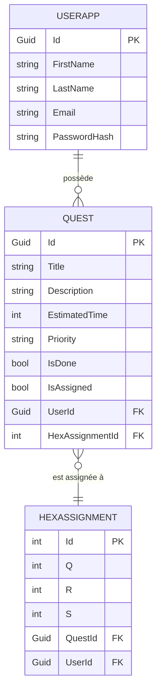
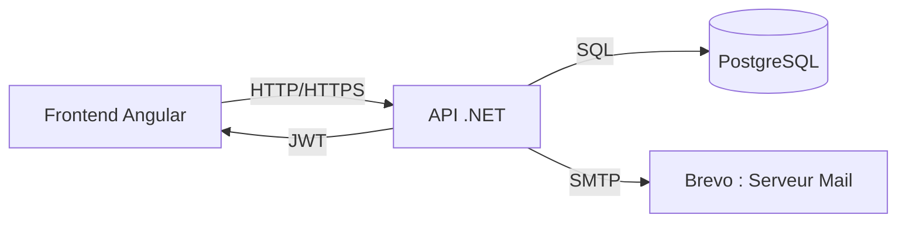

---
# Table des matières
---

# 1. Introduction

## Présentation du projet

HexaPlanning est une application web innovante de gestion de tâches, pensée pour transformer la to-do list classique en une expérience visuelle et ludique. Chaque tâche, appelée "quête", peut être placée sur une carte d’hexagones, permettant à l’utilisateur de visualiser ses objectifs comme un parcours à accomplir. Cette approche vise à rendre la planification plus motivante et interactive, en s’inspirant des mécaniques de jeu et de la gamification.

## Objectifs et contexte

Le projet est né du constat que la gestion des tâches peut rapidement devenir monotone et décourageante, surtout lorsqu’elle se limite à une simple liste. HexaPlanning propose une alternative visuelle et dynamique, où chaque utilisateur peut organiser ses quêtes selon ses priorités et ses envies, tout en bénéficiant d’un suivi clair de sa progression. L’application s’adresse à toute personne souhaitant mieux organiser son temps, que ce soit dans un cadre personnel, scolaire ou professionnel, et met l’accent sur l’ergonomie, la sécurité et la personnalisation de l’expérience.

# 2. Fonctionnalités principales

## Gestion des quêtes (tâches)

Les tâches, appelées "quêtes", sont au cœur de l’application. Chaque quête possède un titre et une priorité (primaire, secondaire ou tertiaire), ainsi qu’une description et un temps estimé en option. L’utilisateur peut créer, éditer, supprimer ou marquer une quête comme terminée. Les quêtes sont organisées en deux onglets : à faire et terminées, pour un suivi clair de la progression.

## Affichage visuel en hexagones (map)

L’originalité d’HexaPlanning réside dans sa représentation visuelle : une carte d’hexagones sur laquelle l’utilisateur peut placer ses quêtes. Chaque hexagone peut accueillir une quête, et un code couleur sur le liseré permet d’identifier rapidement la priorité. Les quêtes terminées apparaissent avec un fond plus sombre. L’utilisateur peut assigner ou désassigner une quête à un hexagone d’un simple clic, et visualiser son parcours comme un chemin à accomplir.

## Système d’authentification et gestion des utilisateurs

L’accès à l’application nécessite la création d’un compte et une authentification sécurisée. Un système de gestion des mots de passe oubliés est en place, avec envoi d’email pour la réinitialisation. L’utilisateur peut également changer son mot de passe depuis l’interface. La sécurité des données et la protection contre les accès non autorisés sont assurées par des mécanismes robustes côté backend.

## Navigation et ergonomie

L’application propose un menu permettant de naviguer facilement entre l’accueil, la liste des quêtes, la carte des hexagones et les paramètres. Un bouton dédié permet de créer rapidement une nouvelle quête. L’interface est pensée pour être intuitive, responsive et agréable à utiliser, afin de maximiser l’engagement et la productivité de l’utilisateur.

# 3. Modélisation des données

## MCD (Modèle Conceptuel de Données)

## MLD (Modèle Logique de Données)

- Table **UserApp** (Id PK, FirstName, LastName, Email, PasswordHash, ...)
- Table **Quest** (Id PK, Title, Description, EstimatedTime, Priority, IsDone, IsAssigned, UserId FK, HexAssignmentId FK)
- Table **HexAssignment** (Id PK, Q, R, S, QuestId FK, UserId FK)

## Description des entités et relations

- Un utilisateur peut créer plusieurs quêtes.
- Une quête appartient à un seul utilisateur.
- Une quête peut être assignée à un hexagone (HexAssignment) ou non.
- Un hexagone (HexAssignment) est lié à une seule quête et à un seul utilisateur (pour la personnalisation de la map).

4. **Architecture technique**

   - Frontend (Angular)
   - Backend (.NET)
   - Base de données (PostgreSQL)
   - Communication API

# 4. Architecture technique

## 4.1. Vue d’ensemble

L’architecture d’HexaPlanning repose sur un frontend Angular, un backend .NET et une base de données PostgreSQL. Cette approche modulaire facilite la maintenance, l’évolutivité et la sécurité de l’application. La communication entre les différentes couches s’effectue via une API REST sécurisée.

### Schéma global

## 4.2. Frontend (Angular)

- **Technologie** : Angular 18
- **Structure** : Organisation en modules, composants, services et modèles TypeScript.
- **Responsabilité** : Gestion de l’interface utilisateur, navigation, appels API, gestion du token JWT, affichage dynamique de la carte d’hexagones, gestion des quêtes.
- **Sécurité** : Intercepteur HTTP pour l’ajout automatique du JWT, guards de navigation pour protéger les routes sensibles.
- **Tests** : Utilisation de Jest et Cypress pour les tests unitaires et end-to-end.

## 4.3. Backend (.NET)

- **Technologie** : ASP.NET Core 8
- **Structure** : Architecture en couches (Controllers, Services, Models, DataContext, Utilities).
- **Responsabilité** : Exposition d’une API RESTful, gestion de l’authentification (JWT), logique métier (création/gestion des quêtes, hexagones, utilisateurs), validation et sécurisation des données. Un service d’envoi d’e-mails est intégré pour la gestion du mot de passe oublié et d’autres notifications : il s’appuie sur la solution Brevo (anciennement Sendinblue), permettant l’envoi fiable et sécurisé de courriels transactionnels depuis l’API .NET.
- **Sécurité** : Middleware d’authentification JWT, validation des entrées, gestion des droits d’accès, protection contre les attaques courantes.
- **Tests** : Couverture par des tests unitaires (xUnit) et des tests d’intégration.

## 4.4. Base de données (PostgreSQL)

- **Modélisation** : Respect du MCD/MLD présenté plus haut.
- **Gestion** : Migrations Entity Framework Core pour la création et l’évolution du schéma.
- **Sécurité** : Accès restreint via le backend uniquement, aucune exposition directe.

## 4.5. Communication API

- **Format** : JSON via HTTP(S)
- **Endpoints** : Authentification, gestion des quêtes, gestion des hexagones, gestion des utilisateurs.
- **Sécurité** : Toutes les routes sensibles sont protégées par JWT, CORS configuré pour limiter les origines autorisées.

## 4.6. Conteneurisation et déploiement

- **Docker** : Chaque composant (frontend, backend, base de données) dispose de son propre Dockerfile pour faciliter le déploiement et l’isolation.
- **Orchestration** : Utilisation de docker-compose pour le développement local et le déploiement sur serveur.
- **Reverse Proxy** : Nginx Proxy Manager pour la gestion des domaines et des certificats SSL.
- **CI/CD** : Pipelines GitHub Actions pour l’intégration et le déploiement continus.

## 4.7. Sécurité et bonnes pratiques

- **Authentification JWT** pour toutes les opérations sensibles.
- **Validation systématique** des données côté backend.
- **Gestion des erreurs** centralisée.
- **Logs** pour le suivi et l’audit des actions critiques.
- **Séparation stricte** des responsabilités entre frontend et backend.

Cette architecture garantit robustesse, évolutivité et sécurité, tout en permettant une expérience utilisateur fluide et moderne.

5. **Qualité logicielle et tests**

- Tests unitaires (frontend et backend)
- Tests de charge (fixtures avec Bogus)
- Tests d’intégration
- Stratégie de validation

6. **Déploiement et intégration continue**

   - Déploiement continu (CD) avec GitHub Actions
   - Conteneurisation avec Docker
   - Hébergement sur VPS OVH & Nginx Proxy Manager
   - Intégration continue (CI) en cours

7. **Sécurité**

   - Authentification par JWT
   - Validation des données
   - Protection contre les attaques par force brute
   - Gestion du mot de passe oublié
   - Sécurité liée à la conteneurisation

8. **Technologies utilisées**

   - Présentation des choix techniques
   - Avantages et justification

9. **Conclusion et perspectives**
   - Bilan du projet
   - Évolutions possibles

---
